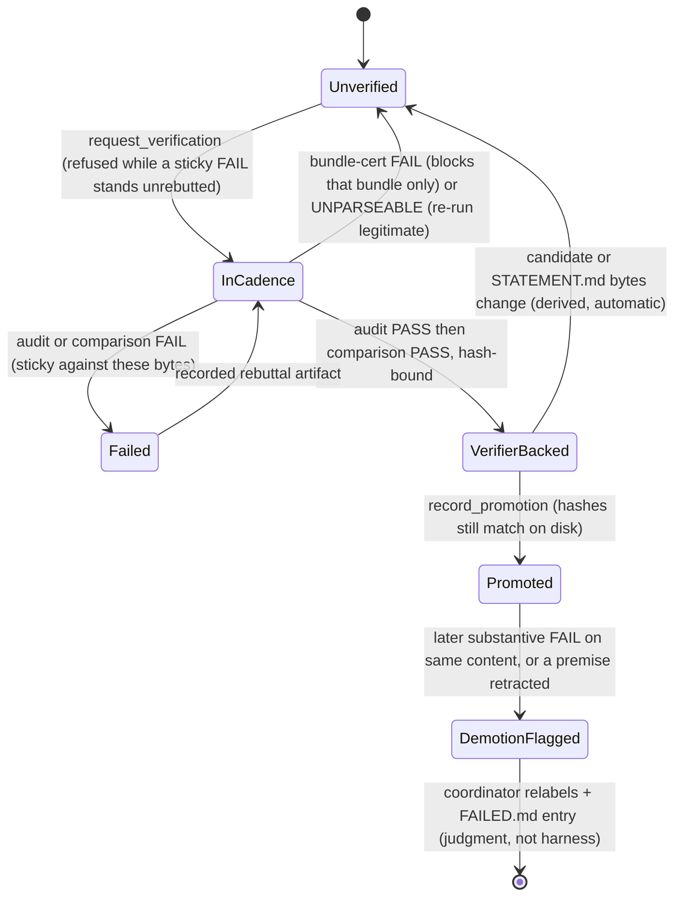
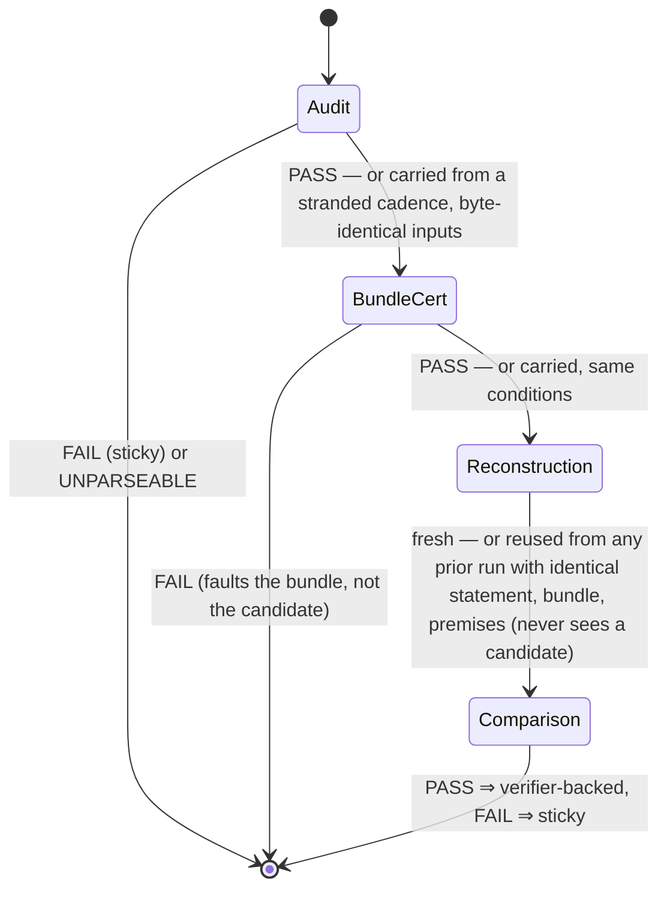
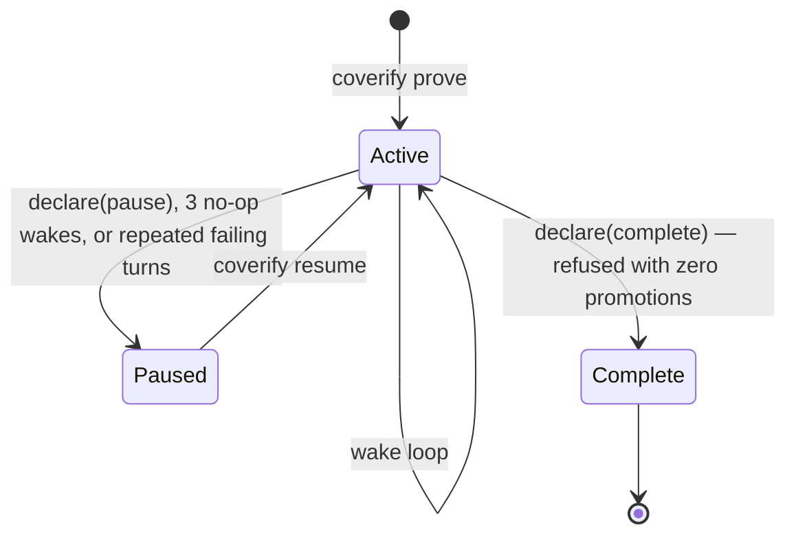

# Coverify Design

Coverify is a mechanical referee for the `math-proof-search` skill. The
skill's launcher contract
(`~/kb/notes/agents/prompts/prompt-math-proof-search-launcher.md`) is the
spec; this harness adds **zero mathematical policy of its own**. A perfectly
obedient harness-agent session running the skill and a coverify run should be
semantically interchangeable — coverify's edge is that the rules which matter
cannot be skipped, forgotten after compaction, or drifted away from.

Three implementation rules follow:

1. **Every enforcement traces to a launcher clause** (conformance table
   below). Role prompts embed the launcher's fenced contract verbatim — never
   a paraphrase. The launcher is read at runtime from `~/kb` (override:
   `COVERIFY_LAUNCHER_PATH`); if it is missing, coverify says so and stops —
   no silent fallback to a remembered version, mirroring SKILL.md.
2. **Unmapped code is semantics-invisible mechanics** (scheduler, handle
   table, wake building, journal). Any such mechanism must be removable
   without changing campaign behavior.
3. **No invented policy defaults.** No harness-invented agent ceiling
   (launcher forbids one); budget gates enforce only limits the user set —
   including recorded standing user policy: `--agent-limit` defaults to 6
   workers per campaign (Chao, 2026-08-08; `--agent-limit 0` = unlimited),
   a user decision the CLI carries, same provenance rule as the model
   defaults. `--no-computation` (opt-in per campaign) is likewise a user-set
   scope constraint, not a harness default: it refuses every technician
   dispatch so the campaign is pure reasoning (Chao, 2026-08-08), and a
   resume re-arms it from the last run-start stamp in the GATE STORE (the
   authority, never the role-adjacent journal) so a crash-resume cannot
   silently re-allow technicians. Ideation families (Chao, 2026-08-09,
   Danus-study grounding in docs/skill-feedback.md) are the same provenance
   pattern: dispatch_reasoner's optional family field routes one reasoner to
   fable (Anthropic lane: claude-cli/opus since 2026-08-09 — Fable quota exhausted; originally claude-cli/fable; Max subscription), gemini (agy/gemini-3.1-pro-high,
   Google subscription via bin/agy-oracle), or pro (chatgpt-cli/gpt-5-6-pro)
   as toolless single-shot consults — subscription CLIs, never metered APIs;
   specs env-overridable via COVERIFY_FAMILY_<NAME>. For pro, the oracle's
   server-attested served_model must equal the requested slug exactly or the
   reply is discarded as "no useful response" (Chao, 2026-08-09; issue #20 —
   ChatGPT's router measurably downgrades, and weak-model advice must not
   enter a campaign wearing a Pro label). No
   wall-clock timeouts on proof work, ever.

## Campaign state — the skill's own format

A project is a folder. The campaign directory uses the launcher's exact file
set, so a Claude Code/Codex session running the skill can resume a coverify
campaign and vice versa:

```
STATEMENT.md          verbatim statement, conventions, constraints; revisioned
CURRENT_FRONTIER.md   derived operational summary; rewritten last at checkpoints
REGISTRY.md           canonical route + claim-label index (mechanism × terminal gap)
FAILED.md             append-only closed routes with obstructions + retry-novelty bar
PROVED.md             append-only promotions with dependencies + audit provenance
PROCESS_LESSONS.md    process lessons only — the name itself carries the rule
EVIDENCE/             revision-suffixed artifacts; identity = filename (harness-written
                      artifacts are append-only; role scratch edits are instructed)
.coverify/journal.jsonl   derived mirror of the authoritative event log (observability only)
```

Gate-authoritative state lives OUTSIDE the campaign directory
(`~/.local/state/coverify/<campaign-id>/gates.jsonl`), so no role's workspace tools can
forge or erase gate records. The campaign id is stored in
`.coverify/campaign-id` (role-write-denied) rather than derived from the
directory's path: identity has to survive a rename, a restore to another
path, or a different mount, because a campaign with intact ledgers and no
gate history would otherwise re-arm the statement freeze on whatever
`STATEMENT.md` now says and lose every recorded FAIL. A campaign that has run
before but whose gate history is missing is refused rather than adopted
(`COVERIFY_ADOPT=1` accepts a new baseline deliberately). One event log: every
record — gate records and campaign events (wakes, usage, notes, replayed user
guidance) — appends to the out-of-tree store, and the in-tree journal is a
derived mirror written by the same append path, read only for observability
(`status`, `trace`); nothing behavioral is ever read from the role-adjacent
journal (previously standing user guidance was, a forgeable channel on
degraded-confinement platforms). Audit,
reconstruction, and comparison records are content-hash-bound (sha256 of the
candidate and of `STATEMENT.md` at verification time) — a file edited after
its PASS is no longer verifier-backed, and a statement edit without
`coverify amend` hard-stops the next run.

### Layering: core vs. read-only consumers

`src/view/` (trace rendering, session telemetry) holds **pure consumers**:
they read durable state and render it, and NOTHING that runs a campaign may
import them. `scripts/conformance-check.ts` fails the build on the reverse
edge, so observation cannot drift into operations — which also means the two
can be reasoned about, and counted, separately (2026-08-09, Chao: "observation
should be pure consumer"). `cli.ts` is the operator surface and is the single
module permitted to render a view.

The distinction that decides membership is WHO the noticing is for.
`observe.ts` stays in core because its queries feed the coordinator's wake
digest — noticing that changes what the campaign does next is operational.
`view/` is noticing for humans, after the fact, with no path back into a
decision.

Current sizes: core 6,023 lines (4,348 code), view 1,008 lines (820 code).

## Threat model

Roles are **careless, not adversarial**, and the host is expected to be a
sandbox. Confinement exists to stop the accidents that actually happened or
would silently corrupt a campaign:

1. **Runaway compute** — unsupervised or uncapped search that eats the host
   (a campaign's detached search jobs kernel-panicked saturn on 2026-08-01).
2. **Accidental destruction of campaign state** — a rewrite that erases
   closed-route history, a cited artifact edited in place, a promotion
   recorded without its verification.
3. **Silent contamination of verification** — anything that lets the blind
   reconstruction see the candidate, or a verdict be attributed to work that
   did not happen.

A role deliberately evading these mechanisms is **out of scope**: it holds
model weights and a filesystem, and no in-process check is a security
boundary against it. So findings are ranked by whether a reasonable role
doing its job could trip them, not by whether an attacker could. Where a
mechanism has a known evasion (a survivor that leaves its session and
`exec`s an unrelated binary; a symlink raced between check and use), it is
stated rather than claimed away.

## Workspace tools and confinement

Roles have no general shell. The workspace surface is pi's `read`, `ls`, and
`grep` (read-only) plus pi's `write` wrapped with an in-process scope check.
Reads are CONFINED (2026-08-09, issue #22 — measured harm: workers grepping
$HOME literature-hunted their sessions past the model context window and
leaked unrelated files into provider prompts): read/ls/grep accept only the
campaign tree plus prior-route paths declared in the user-frozen
STATEMENT.md (readRoots, workspace.ts; path normalization mirrors pi's own,
bypass-pinned in tests/read-scope.test.ts); `.coverify/` is refused
param-side and filtered result-side (harness state, and transcript reads
would breach verification blindness); every read result is capped at the
same 50k budget as run_script output. The read cap is a hard constant, not
env-tunable — an asymmetry with the batch caps, accepted as context-capacity
supervision, not a work timeout.
Code is a gated role, not a default: a `dispatch_technician` packet's `computation` declaration (launcher: "Use computation only for a
preregistered finite domain and stopping rule…") dispatches a *computation technician* — a distinct role whose mathematics is confined to
faithfully encoding the preregistered statement into code; it advances no
proofs and iterates only within the declared domain. Only the technician
gets `run_script` — the sole way any role executes code — and the right to
write non-prose files; reasoners and the coordinator write
`.md`/`.txt` only and never execute anything. Because dispatches are already
async handles, a technician dispatch IS the async computation: no separate
computation-handle machinery is needed for local runs. The dispatch gate
refuses a `computation` field with no concrete bounds and refuses a
technician dispatch on a tool-less CLI oracle backend. Dispatched agents' scope
is their assigned `EVIDENCE/<id>/` directory; the coordinator's is the
campaign dir *except* `.coverify/`, `STATEMENT.md`, and `PROVED.md` (deny
wins). `PROVED.md` is appendable only through the `record_promotion` tool,
which re-checks both verification stages and the content hashes before
writing. Scope checks resolve the *final* path component, so a symlink a
role plants inside its own directory is judged by its target — without that,
a deny-list entry (or the script-path confinement below) is only a naming
convention.

Web access is likewise a gated grant, and it is delegated: a reasoner whose
packet carries a `literature` question gets `literature_search`, which
spawns an external librarian CLI agent (`COVERIFY_LITERATURE_CMD`, default
`agy` print-mode with live web search) through the *same* supervision as
`run_script` — shared wall limit, RSS cap, whole-tree kill, exit reaper,
abort signal — and archives the full compiled report as `literature-<n>.md`
evidence (self-attested provenance, like `fable-review`). That name is
harness-owned: no role may author or edit a `literature-<n>.md`, so a
citation always corresponds to a search that actually ran. The librarian runs under the role's write
sandbox plus a narrow allowance for its own state directories
(`COVERIFY_LITERATURE_STATE_DIRS`, default the `agy`/Gemini dirs) — never
`~/.claude`, `~/.codex`, or `~/.config`, which hold settings and hook files
that execute later and coverify's own OAuth store. No campaign role ever
touches the network itself; `literature` exists only on reasoner packets and `computation` only on
technician packets, so the role that reads the web structurally holds no
code tools; the coordinator and all
verification-cadence roles have neither grant, keeping blind reconstruction
uncontaminated.

`run_script` runs a batch of 1–8 script files (`.py` under python3, or
executables) concurrently by argv — no shell, so detach primitives
(setsid/nohup/disown, tmux -d, screen -dm) are not even expressible. Each script
must additionally resolve inside the role's own write scope, so a host
interpreter (`/bin/sh -c …`, `python3 -c …`) cannot be named as the script
and hand the shell back. Each run is its own process group; the whole batch
shares one time limit and one combined RSS cap (`COVERIFY_RUN_MEM_MB`,
default 4096). At batch end (or when a cap trips) the harness kills the
groups and then sweeps `ps` for survivors — processes still descended from
the batch, sharing its groups, or still running one of its script paths —
because a child that calls `setpgrp()` and is reparented to pid 1 is
invisible to a group kill alone. The sweep matches whole argv tokens naming the batch's own script paths, plus
its working directory when that directory belongs exclusively to the batch (a
dispatched agent's evidence directory) — which is what catches a helper
launched in a new session running a different file there. On a shared
directory (vanilla pi through the extension) the directory is not matched:
killing by it would reap other agents' and tools' processes, so that recall is
given up deliberately. A survivor that
leaves its session *and* `exec`s a binary naming nothing in the workspace
would evade it; the technician is a supervised role, not an adversary, so
that residual is stated rather than claimed away. If `ps` itself fails, the batch is killed and the failure
reported — the cap never silently disappears. The harness also reaps live
batches on `exit`/SIGINT/SIGTERM/SIGHUP and on `cancel_agent`'s abort
signal, so operator Ctrl-C or a crash takes the compute with it instead of
leaving detached groups with no watchdog. The batch is intra-turn concurrency for one
technician; harness-level async computation handles remain the roadmap item.
The scoped write tool additionally enforces ledger integrity: `FAILED.md`
rewrites must preserve the existing content as an unchanged prefix
(launcher: append-only), and `literature-<n>.md` librarian reports are
immutable. Enforcement tests live in `tests/` and run in `bun run check`. Script writes are OS-sandboxed on macOS (`sandbox-exec`,
deny-default writes; reads unrestricted) to the same scope. On non-darwin
platforms the same scope is enforced via `@landstrip/landstrip`
(Landlock + seccomp, deny-default writes and networking); only if the
landstrip binary is missing does confinement degrade to instructed-only,
announced loudly at run start. (A campaign placed under the system
temp tree is inside the sandbox's blanket temp allowance — keep campaigns in
real project directories.) Long or parallel computation goes through the
scheduler front door, per the launcher.

## Runtime shape

```
cli.ts           prove / resume / stop / status / trace / turns / say / amend / login / logout
                 (the operator surface — the one module allowed to render a view)
campaign.ts      state layer: init, revisions, append-only evidence, resume bundle
launcher.ts      load + extract the fenced launcher contract (no fallback)
roles.ts         role charges + LIBRARIAN_CHARGE (all coverify-authored role text; no re-exports)
sandbox.ts       OS supervision + confinement mechanics: reaper, sandboxing, supervise() batch runner
workspace.ts     the role tool surface: run_script, librarian, write rules, readRoots/confineReads
backends.ts      subscription CLI transports (claude/codex/chatgpt/agy) + served-model attestation
providers.ts     model providers, per-role specs + ideation families, runRole, harness sessions
coordinator-tools.ts clause-mapped coordinator tool surface (coordinatorTools(deps) factory)
claude-bridge.ts pi-claude-bridge as a pi-ai provider (subscription tool loop)
gates.ts         dispatch gate, idea-gate ledger, verification state, promotion
cadence.ts       the two-stage verification cadence (the clause-dense core)
harness.ts       handle table, event loop, wakes; the only persistent process
observe.ts       records + noticing queries: run-config stamp, ledger history,
                 refusal events + unaddressed-refusal noticing, wake bookkeeping
                 (prompt-surfaced noticing; never gates, dispatches, or ledgers)
view/trace.ts         journal -> self-contained HTML timeline (read-only observability)
trace-page.ts    that page's markup, styles, and view code
pi-extension.ts  interactive-pi boundary layer: supervised run_script in
                 place of raw bash (phase 3; never writes trusted state)
```

Observability layering (redesign phases 1–3): the **pi session JSONL trees**
under `.coverify/sessions/` are the authoritative per-agent transcripts
(full content, branchable, crash-survivable) and the single transcript
store — per-turn telemetry (sizes/usage/gaps/stopReason) is a pure
function of the stored messages, derived on demand by `coverify turns`
(src/turns.ts, read-only) rather than maintained as a sidecar; the
journal remains the event index. A campaign directory is now openable in
three harnesses: coverify headless, the raw skill in Codex, and interactive
pi with `src/pi-extension.ts` loaded.

- **Coordinator**: resident across wakes — matching how the skill runs in a
  live Codex/Claude Code session — as a durable pi AgentHarness session
  (JSONL tree under `.coverify/sessions/`). At the context cap
  (`COVERIFY_COORDINATOR_CONTEXT_TOKENS`, default ~300k) it **compacts in
  place** — the launcher's anticipated "context compaction", with the
  summary explicitly subordinated to the ledgers and the restart-rule
  reread instruction delivered in the next wake message (kill-and-rebuild
  remains the fallback for non-compactable sessions). Continuing wakes
  receive only new reports + status digest; the full resume bundle is sent
  on (re)build. Sole ledger writer. Decisions must still be externalized to
  the ledgers every wake — residency is continuity of soft context, never a
  substitute for durable state.
- **Reasoners and technicians**: fresh AgentHarness sessions (durable JSONL
  transcripts, session id = handle id = prompt_cache_key); packet in, finite deliverable out;
  write access only to assigned `EVIDENCE/` paths.
- **Verifiers**: the stage-1 hostile auditor, bundle certifier, stage-2
  blind reconstructor, and comparator are fresh instances; the harness
  withholds the candidate from the reconstructor (platform-enforced), while
  the keyIdeas/allowedSources bundle is coordinator-authored and gated by
  certification (see honesty ledger). The journal records supplied inputs,
  visibility, and model family per call.
- **Dispatched work is stoppable through one verb**, whatever runs it: a
  handle carries `stop()`, which aborts a pi session, kills a spawned CLI, or
  makes a composite verification cadence stop recording. `cancel_agent` and a
  campaign declaration no longer ask what substrate a handle is — previously
  they called `session?.abort()`, which was a silent no-op for every
  CLI-backed role, so an in-flight `claude -p` audit outlived a pause, billed
  a full run, and landed its verdict nowhere. Spawned CLIs are also registered
  with the exit reaper and clean up their temp directories, so a dying harness
  takes them with it.
- **One writer per campaign**: a run holds `.coverify/lock.json` for its whole
  life and releases it on every exit path. Handle ids come from a counter each
  process computes once, `GateStore` snapshots its records at construction, and
  evidence directories are handed out by name — so two runs would mint the same
  `r001`, give one directory to two agents, and each gate against records
  missing the other's FAILs. A lock whose holder is gone is taken over and the
  takeover journaled; an idle campaign parked on a handle looks dead, which is
  exactly when a second run gets started by accident.
- **Delivery is recorded, not assumed**: showing a report to the coordinator
  is a second obligation after persisting it, and it is journaled as a
  `delivery` record only once the turn that showed it succeeded. A wake that
  throws, or a run that ends at its wake limit, therefore re-offers the report
  at the next wake or the next run — without it, a persisted completion is
  excluded from the lost-work list and no coordinator ever sees it.
- **Standing user guidance is replayed**: delivered `coverify say` directives
  are journaled and re-sent on any prompt that rebuilds context (first wake of
  a run, and after an in-place compaction), because a delivered message
  otherwise lives only in the coordinator's conversation and silently stops
  applying at the next restart.
- **Durability is at settle, not at harvest**: when a dispatch's promise
  settles, its report is written to `EVIDENCE/<id>/report.rN.md` and its
  completion journaled immediately; the settled queue then carries only a
  pointer for delivery to the coordinator. Three defects (pause, the
  wake-limit exit, the declaration return) each lost finished work because an
  exit path skipped a harvest step — with the write at settle time, no exit
  path can lose a report. A report that arrives after `cancel_agent` is still
  written, journaled as a late artifact rather than a second completion.
- **Handles are the async primitive**: worker/technician dispatches and
  verification cadences are handles in one table; completions wake the
  coordinator — no polling. Gate critics run synchronously inside the
  coordinator's tool call (single-shot verdicts, short).

## State diagrams (derived, never stored)

The system is full of state machines, but no state is ever stored — there is
no status field anywhere. Every "state" below is recomputed at the moment of
decision from two things: the append-only gate records and the current bytes
on disk. That is deliberate, three times over. A stored status would be one
write away from forging `verifier-backed`, while the records are hash-bound
and live out of tree. A stored status would go stale silently — here, editing
a promoted candidate's file *is* its demotion, because the derived state
stops matching without anyone having to notice and update a field. And
several "states" are properties of the whole history, not of the current
node: a substantive FAIL sticks to content across renames, and stranded-ness
is "dispatch without completion", both queries over the log. The diagrams
are documentation of those queries; the code they describe is
`verificationState`, `checkPromotion`, `priorReusableRecord`,
`promotionsNeedingRetraction`, and the handle table.

A revision's life, keyed on (candidate content hash, statement hash) — a
repair is deliberately **not** a transition: new bytes are a new machine, and
the old machine's FAIL stays on record against the old content forever:



Inside one verification handle, the cadence is linear with early exits; the
carry-forward edges are the information-flow policy from the review record:



Every dispatch (worker, gate, verification) is one handle:

```mermaid
stateDiagram-v2
    [*] --> Live: dispatch record, then registerHandle starts the work
    Live --> Settled: final report, infrastructure failure, or cancel_agent
    Settled --> Delivered: completion record at settle time; delivery record after the wake that showed it
    Live --> Stranded: process death (dispatch record, no completion record)
    Stranded --> [*]: restart notes it; a stranded verification's stage PASSes are carry-forward eligible
```

The campaign itself:



## Conformance table

| Mechanical enforcement (code) | Launcher clause |
| --- | --- |
| `STATEMENT.md` written once; new revision only via explicit user amendment; completion evidence invalidated | "Fix its revision before search; only an explicit user amendment may replace it…" |
| Campaign file set; harness-written evidence is revision-suffixed (`newEvidencePath`), and `FAILED.md` prefix-append plus `literature-*.md` immutability are enforced (workspace.ts: `APPEND_ONLY_LEDGERS`, write wrapper). Other in-place edits under `EVIDENCE/` are contract-instructed, not blocked — a role can still overwrite its own scratch artifact | "Durable campaign state" bullets |
| Read scope (workspace.ts: `readRoots`/`confineReads`): roles read only the campaign tree plus STATEMENT.md-declared prior-route paths; `.coverify/` refused param-side and filtered result-side; 50k per-result cap. Confinement, not emulation of platform isolation — recorded honestly in the ledger below (prose roles enforced; scripts instructed-only) | "Use stronger platform enforcement if available; do not emulate it with a second proof-state system." / blindness recording clause |
| Dispatched agents get no ledger-write capability; only assigned evidence paths | "The coordinator is the sole ledger writer; workers… write only assigned evidence artifacts" |
| Resume bundle = STATEMENT + FRONTIER + full REGISTRY.md + full PROCESS_LESSONS.md, launcher embedded verbatim in the system prompt (never FAILED.md, PROVED.md, or EVIDENCE/ wholesale) — supplied on every coordinator (re)build **and re-supplied on the wake after every in-place compaction**, so both halves of the clause are enforced, not instructed | "After restart or context compaction, reread…" |
| Claim-label vocabulary quoted verbatim into the ledger templates at init; label discipline and weakest-premise inheritance are contract-instructed model judgment | "Claim labels — literal, never inflated" |
| Dispatch schema requires the FAILED.md check field (`no close prior route` / `closest is X; differs because…`) | "Before every route, materially changed retry, or variant, check `FAILED.md`…" |
| Worker packet schema requires a finite mathematical deliverable; the deliverable-or-precise-gap report form is charged in the role prompt, not parsed | "Every exploration agent must return a proved lemma, explicit construction, counterexample/certificate, or a precise failing implication" |
| No harness timeouts on proof/audit/reconstruction work (the per-run_script batch cap is surfaced in the tool description and env-tunable; the 50k read-result cap is context-capacity supervision, not a work timeout; consult/search CLIs — agy-oracle, the chatgpt oracle, the librarian — run with 7-DAY supervision bounds: hang protection, never work limits (user decision: no timeouts on model thinking, Chao 2026-08-09); only the run_script batch cap remains a real wall, as compute host-protection) | "Do not impose a coordinator-created elapsed-time limit…" |
| Code tools (`run_script` + non-prose writes; workspace.ts: `PROSE_EXTS`) exist only on a technician dispatched with a computation declaration with concrete bounds; dispatch gate refuses thin declarations; coordinator is prose-only; the dispatch returns the REGISTRY.md launch record (workload, limits, output paths, cancellation) | "Use computation only for a preregistered finite domain and stopping rule yielding a small witness, certificate, or table." / "Never run unsupervised detached compute." |
| Mechanism identity for gate keys is normalized (trimmed, whitespace-collapsed, case-folded), so retyping a mechanism neither evades the wave gate nor discards an IDEA PASS already earned | "Do not allow recursive subagent fan-out or a large route wave before the parent mechanism receives `IDEA PASS`…" |
| Wave gate: a second **concurrent** worker on a mechanism requires `IDEA PASS` on file; sequential retries get an advisory reminder, not a refusal (that judgment is the coordinator's); single first-wave scouts exempt | "Do not allow recursive subagent fan-out or a large route wave before the parent mechanism receives `IDEA PASS`…" |
| Verification = stage 1 (fresh hostile audit) then stage 2: bundle certification (fresh agent sees candidate + bundle; leaky bundle refused, same-bundle retry hash-blocked) → blind reconstruction (no verdict) → fresh comparison carrying stage 2's verdict with the contract's match semantics; all outputs saved as citable EVIDENCE artifacts, hash-bound; a reusable reconstruction is bound to the candidate hash as well as its own artifact hash, so a repaired candidate always gets a fresh one | "Verification cadence" 1–2 (2026-07-31 revision): bundle certification, "a fresh comparison agent…", explicit PASS/mismatch semantics |
| Anti-verdict-shopping: a substantive audit/comparison FAIL blocks re-verification of that content — matched by candidate hash, so copying the bytes to a new filename inherits the FAIL — unless a recorded rebuttal artifact is supplied; every attempt stays on record | "A substantive FAIL from any stage stands… Do not rerun a failed stage on an unchanged revision in search of a PASS" |
| Any content change ⇒ every stage reruns, reconstruction included: the contract says a load-bearing repair must "rerun a fresh hostile audit and then a fresh reconstruction. Never reuse a verifier response that influenced the repair", and the comparator's FAIL is quoted into the wake that prompts the repair. Reuse is limited to a re-run on the byte-identical candidate (a protocol or infrastructure failure): an audit or bundle-cert PASS carries forward (`priorReusableRecord`, requireStranded) only when every input hash (candidate, statement, promoted premises, declared dependencies / bundle) matches, its saved artifact is byte-unchanged, **and** its own cadence is stranded — a verification dispatch with no completion record, the journal's definition of an infrastructure failure (campaign 2026-08-01 v033/v035). A PASS from a completed cadence is never reused, so a rebuttal challenge or duplicate re-request reruns every stage fresh; the comparison, being the final verdict, is never reused at all. Carrying stages forward for a certified non-load-bearing diff is legal but needs a fresh delta auditor's PASS, which is not built (roadmap) | Revision-impact rules |
| `record_promotion` is the sole writer of `PROVED.md` (direct writes OS-denied); legal only when both stage records exist for the exact revision with matching content hashes; entry carries dependency identities, audit-artifact citations, and the verified candidate's content hash. The promoted statement text itself is coordinator-authored and not machine-checked against the candidate — see the honesty ledger | "Promotion records the revision and dependency identities plus every audit…" |
| Campaign ends only by explicit `declare_campaign_state`; "complete" refused with zero promotions on record; an idle wake gets a nudge, and 3 consecutive no-op wakes trigger an operational *pause* (never a completion) as spend protection | "Do not mark it complete until the final result passes the full cadence…"; "Failed attempts… are not permission to return"; "Pause is operational state" (pause stops further wakes; live agents are not force-aborted — use cancel_agent) |
| Harvest before judgment: worker reports are saved to EVIDENCE/ and completion-recorded before any model sees them; checkpoint ordering itself is contract-instructed, not enforced (struck as over-constraint — see review record) | "Checkpoint and learning loop" |
| Campaign loop persists across restarts until user stop or completion; `declare_campaign_state` interrupts live agents and cancels their computations unless `continueSupervised` is set (the contract's "explicitly authorized to continue under supervision"), then stops after the wake | "The initial resolution request remains authorization…" |
| Journal records each audit's supplied inputs, visibility, model family, and instructed-vs-platform-enforced restrictions | "Every audit records the supplied inputs, workspace/tool visibility, model-family provenance…" |
| No agent-count ceiling; budget gate enforces only user/workspace/runtime limits | "Do not impose a fixed agent-count ceiling… scaling to available concurrency and any explicit user, workspace, or runtime limits" |

Judgment stays with models: route selection, packet composition, inline
derivations when the coordinator judges them cheaper than a packet, gate and
audit verdicts, struggle rulings, promotion decisions, lesson content, and
whether a sequential retry constitutes a "follow-up wave" needing the gate.
Mechanics-only (rule 2): handle table, event-driven wakes with ambient status
digests, journal, out-of-tree gate store, write sandbox, verdict-line parsing,
version stamps, and the user message inbox (`coverify say` →
`.coverify/inbox.jsonl`): verbatim transport of user guidance — steered
into the coordinator's running turn (a ~1s inbox watcher over session
`steer`), else delivered at the next wake; the headless analog of typing
to an interactive skill session. The inbox lives under `.coverify/`, which
every role's write scope denies, so a role cannot forge user guidance;
delivery is journaled and at-least-once (a message steered into a turn
that then fails redelivers at the next wake), and a statement change still
requires `coverify amend` (the delivered block says so).

**Honesty ledger** (launcher: record instructed-vs-platform-enforced): the
candidate withheld from the reconstructor and all write confinement are
platform-enforced (macOS); the bundle (`keyIdeas`/`allowedSources`) is
coordinator-authored but now passes a mandatory certification by a fresh
agent before stage 2 runs (contract-required; the certification itself is
model judgment, recorded as such); `declaredDependencies` remains
instructed-only, mitigated by giving the stage-1 auditor PROVED.md. The
promoted statement text in `record_promotion` is likewise coordinator-
authored and unverifiable by the harness — nothing mechanically checks that
it is what the candidate proves, so PROVED.md entries carry the verified
revision and its content hash and an over-claim is auditable against that
exact artifact, not prevented. Re-verification after a substantive FAIL
requires a rebuttal artifact to exist, but its content is never read or
shown to a verifier; the anti-shopping property is that every attempt stays
on record and the latest verdict per stage decides, not that a determined
coordinator cannot resample.
Non-darwin platforms: write confinement OS-enforced via landstrip
(Landlock + seccomp), degrading loudly to instructed-only when the binary
is absent. `claude-cli/*`
verdict roles run as `claude -p` subprocesses: fresh process per call, run
in an empty temp directory, but the CLI carries its own tools (file read,
web search) — their isolation is instructed-only, and the journal's
modelFamily field discloses the backend per call. A `claude-bridge`
coordinator runs its tool loop through the Claude Agent SDK
(pi-claude-bridge): the bridge starts Claude Code with built-in tools
disabled and strict MCP config, so the model's whole tool surface is
coverify's own (workspace + gate tools) — confinement is unchanged,
though tool-disablement there is SDK-flag-enforced rather than
OS-enforced. Concurrent bridge sessions cross-contaminate (observed in
testing), so claude-bridge is coordinator-only, refused at preflight for
every other role.

## Retry stack (bounded, layered)

Transport failures are absorbed at two layers with a documented ceiling:
the pi-ai patch retries a mid-stream transport death inside the provider
(PI_CODEX_MIDSTREAM_RETRIES, default 2 → ≤3 stream attempts per prompt
call), and the ask-boundary wrapper retries the whole turn
(COVERIFY_RETRY_MAX, default 3 → ≤4 turn attempts). Worst case is
therefore ≤12 stream attempts per turn with exponential backoff at both
layers; quota/billing errors are never retried at either. cancel_agent
interrupts the stack between attempts (the wrapper's backoff honors the
session's abort signal). The provider layer is a local bun patch
(patches/) carried while upstream earendil-works/pi#7820 is open — drop
it when pi ships provider-level stream retry.

## Efficiency commitments

Verify at trust boundaries (promotions, resolution claims), not per
micro-fact; gate before the wave; finite deliverables, never clocks; the
FAILED/REGISTRY indexes stop re-funding dead routes; budgets enforced at
dispatch; every role instance is fresh — workers get one packet each, and
fresh instances are mandatory where they buy trust (critics, verifiers).

## Observability

Usage records tokens and model identity, never dollars (2026-08-09). Every
role runs on a subscription lane (`ROLE_DEFAULTS`), so a provider-reported
price — pi's per-message cost, `claude -p`'s `total_cost_usd` — is notional
list price rather than money spent, and a field named `costUSD` asserted
otherwise on every record that carried it. The removed field had also been
lying in three narrower ways: summed cadences of unpriced CLI stages emitted
a concrete `costUSD: 0` over millions of tokens (115 such records in the
2026-08-08 fleet, worst at 7,053,222 tokens), `campaignTurns` read a
flattened `costUSD` the session log never contains — so every priced
coordinator session read as unpriced — and the partial-sum marker added to
paper over heterogeneous backends only widened the surface. Records now
carry token counts plus `modelFamily` (with `servedModel` attestation where
a backend gives one); a reader wanting dollars applies a rate table at read
time, where "these are list prices" is an explicit assumption. Optional
fields stay absent unless a backend reported them: a measured `reasoning: 0`
and "no backend reported the field" are different records.

Cache-write spend is unmeasurable, and the provider prices did not fix it:
`cacheWrite` is hardcoded 0 upstream (pi #6469) and measures 0 across all
4,117 pi-path messages in the fleet, with pi attributing $0.00 to it — so
the provider-computed price inherited the same blind spot a read-time rate
table would have. Note it as a known floor on any cost derivation rather
than trusting a number that silently excludes it. `claude-cli` does report
`cacheWrite` correctly (178/178 records); `codex-cli` never does (0/382).

Reported-model identity (#21 P3, 2026-08-09): verdict records carry
`reportedModel` when the backend states what actually answered —
`claude-cli` reports it in its JSON (`modelUsage`/`canonicalModel`);
`codex-cli` emits no model echo in its JSONL (verified 2026-08-09), so it
stays undefined rather than fabricated; `chatgpt-cli` reports a
server-attested `served_model`, which is stronger and drives `modelFamily`
itself (issue #20). The companion query `modelSubstitutions()` surfaces
disagreements in the wake digest — journal-only, never a refusal: the
harness states the fact that a cross-family audit may have run same-family
and leaves the judgment to the coordinator (rule 3).


`coverify trace [--dir campaign] [--out file.html]` renders the campaign
journal as a self-contained HTML timeline: agent lifetimes as ranges,
verification and gate verdicts as points, coordinator wakes as bands, plus
summary tiles and a table view. The widget is vis-timeline, vendored and
inlined at render time, so a trace opens offline and under a strict CSP.
Clicking any bar or mark opens an inspector showing the whole record: the
packet the agent was given (task, deliverable, context, FAILED.md check, and
the computation or literature declaration), its model, evidence directory,
and its report inlined. A trace can only show what the journal recorded, so
dispatches now journal the full packet; fields a campaign predates are
labelled "not recorded by the harness revision that ran this campaign"
rather than rendered blank.

The page leads with its own view — summary tiles, the timeline, the table —
because that is the monitoring read: campaign-shaped, instant, offline. A
Perfetto deep-dive surface (embedded ui.perfetto.dev + `--format perfetto`
export) existed briefly and was removed 2026-08-02: campaign traces are
dozens of events at minute granularity, and the offline timeline answers
them. The trace is not a second state system: it is a projection of the
journal.

Both are read-only by construction — they consume harness audit metadata and
write one file under `.coverify/`, never campaign state, so they cannot
change campaign semantics (rule 2). They also work on a live campaign;
in-flight dispatches simply show as "no completion recorded".

## Analytics: query in place

The authoritative event corpus is small by construction (~1.4 MB across
all campaigns ever, measured 2026-08-08), so analytics is a convention,
not infrastructure: DuckDB directly over the out-of-tree JSONL
(`read_json_auto(..., format='newline_delimited', union_by_name=true,
filename=true)` — drift-tolerant, cross-campaign by filename, zero sync,
no second trust domain). Canonical queries live in the appendix below.
Derived stores were reviewed and rejected (synced SQLite: schema drift
yields confidently wrong answers; OTel-shaped events: a one-way projection
if ever wanted, never the authoritative shape). House rule from the same
review: every new record ships with the derived query that makes it
actionable — an unread log is not an audit trail (see issue #21).

## Skill feedback

Candidate improvements to the skill discovered during this design are
tracked in `docs/skill-feedback.md`. Policy: do not edit the canonical skill
until this harness has run a real campaign; the only planned zero-risk edit
is a note that a conformant harness exists and campaign directories are
interchangeable.

**Correction to the review record (2026-07-31):** the over-constraint audit's
F2 struck "no inline proof work" from the coordinator charge as invented
policy, but it had read only the launcher — the delegation rule lived in
SKILL.md's thin-coordinator adapter. A subsequent spec audit (third
adversarial review, 2026-07-31) folded that rule and the non-circular
reduction gate natively into the launcher, rewrote verification stage 2
(bundle certification → blind reconstruction → named comparison agent with
explicit match semantics), added the anti-verdict-shopping rules, and
slimmed both SKILL.md adapters to runtime-specific mechanics. The charge now
cites the launcher directly. With a resident coordinator the delegation
rationale is structural: inline proof work pollutes the long-lived judgment
context and accelerates compaction.

**Honesty notes from the 2026-08-02 runtime-migration review:** (1) the
compaction summary is produced by pi's generic summarizer
(`SUMMARIZATION_SYSTEM_PROMPT`), a distinct stateless utility call outside
the contract; it enters the coordinator's context as soft user-role text
with a fixed ~20k-token verbatim tail, is billed at the coordinator's model
and thinking level, its spend is counted into the usage journal via the
compaction entry, and the ledgers remain authoritative (re-supplied in the
next wake). (2) Session JSONL trees under `.coverify/sessions/` are full
transcripts on disk. The pi read tools now refuse and filter `.coverify/`
(2026-08-09), so the transcript-read block is tool-surface-enforced for
prose roles — but a technician's run_script executes at the OS level where
both sandbox backends deny writes only, so against a script the block is
(instructed only), not (enforced). Blind roles remain toolless.
(3) Prompt purity of harness sessions is by construction — AgentHarness
uses the `systemPrompt` string verbatim with no hooks registered and empty
resources — verified against pi source at 0.83.0; re-verify on pi upgrades.

## Review record

Before the first campaign, the design and code were adversarially reviewed by
two independent strong agents (2026-07-31): an over-constraint audit (found:
invented wave-gate threshold, invented exit condition, invented "no inline
proof work" rule, stage-2 verdict predicate error, reconstructor starved of
allowed sources — all fixed) and an under-hardening audit (found: gate state
forgeable via role workspace tools, promotion advisory-only, evidence/statement TOCTOU,
spoofable verdict regex, missing comparison step, resume id collisions — all
fixed except items noted "acceptable for now" in the audits: key-idea
paraphrase risk and idea-gate mechanism-string keying remain model judgment,
recorded honestly). Git auto-commit of campaigns was reviewed and **rejected**
as a second versioning system; git remains a user convention. Mechanical
checkpoint-ordering enforcement and coordinator-cache machinery were struck
from the roadmap as over-constraint waiting to happen.

**Uniformity review (2026-08-02, three independent agents: altitude,
conformance, implementation-shape).** A proposed "role-call descriptor +
uniform runner" framework for the six single-shot roles was **rejected**: the
three roles outside `verdictStage` differ in control flow and record schema,
not parameters (gate: no artifact, 3-token contract, async handle, `gate:`
mechanism prefix; reconstructor: no verdict by repaired design, content-bound
carry-forward; CLI oracle: worker-journaled), so discriminators would exceed
the ~50 duplicated lines; the implementation review catalogued 16 hidden
couplings, the worst being that the `bundle` string's bytes key both the
leaky-bundle refusal and reconstruction carry-forward. Unified verdict-token
vocabularies were rejected (merging would let `IDEA PASS` satisfy a cadence
stage). **Adopted in narrowed form:** (1) cadence prompts and their
`suppliedInputs` derive from one section list (they can no longer drift;
`blindness` stays hand-authored — it carries enforcement-modality and
content-provenance claims a section list cannot express, and the
carry-forward record keeps its hand-written provenance since no prompt
exists); (2) an unparseable verdict reply is recorded `UNPARSEABLE`, never
`FAIL` — a protocol failure must not arm anti-verdict-shopping nor
permanently hash-block a legitimate bundle (previously a garbled certifier
reply was a permanent trap); (3) a `toolVisibility` journal field on
verification records (the launcher's previously-unrecorded honesty limb —
CLI backends may expose their own tools, instructed-only, and a CLI role can
be stopped but not steered); (4) reconstruction
blindness is platform-enforced: `assertCandidateWithheld` refuses a rendered
reconstructor prompt containing the candidate text (tests/blindness.test.ts),
upgrading the journal's "(enforced)" from testimony to checked fact; (5) the
user `--agent-limit` counts workers (r*/t*) only — judge handles (g*/v*)
no longer consume the workers' budget.

**Danus adoption review (2026-08-07, five independent measured
evaluations).** Each major design element of frenzymath's Danus was
evaluated for adoption against measured data from a real Danus campaign
(`directed-cut-union`, 2026-07-22 on jupiter: 7 workers, 74 verified facts,
~618M input tokens in ~4h, terminated by quota exhaustion) and the lin3cut
coverify campaigns. **Rejected:** per-lemma admission verification with a
fact DAG (composition already works at promotion grain — one lin3cut
promotion is imported by 5 later ones with revision-exact prose citations;
per-lemma cadence would have cost ~2.5–3× campaign 2's 91 verification
calls, and 63/74 Danus facts (85%) lie outside the answer theorems'
dependency ancestry); typed global-memory channels with search retrieval
(Danus workers ran 2,175 `gm_search` calls, but only because
fresh-per-round self-directed workers must rebuild context — coverify's
resume bundle measured ~5k tokens, ~2% of peak coordinator context, zero
strain; revisit only if FAILED.md passes ~150–200 entries, and then as
indexed search over the existing ledgers, never as new channels);
self-directed always-on workers (6 of 7 Danus workers independently
formalized the same 4-label encoding; workers contributing zero answer
ancestry burned 48% of worker spend); glossary mechanics (Danus's project
glossary accumulated 103 conflicting symbol definitions and prevented no
drift; zero of its 9 verifier rejections were notation-caused;
reconstruction+comparison already verify convention agreement
semantically). **Exposed about coverify:** campaign 2's journal shows
workers idle ~59% of the worker window behind serialized coordinator
judgment — measured on a run predating the async-verification handle, so
re-measure via the idle metric (issue #15) before pipelining dispatch.
**Adopted:** trace dead-weight and worker-idle metrics (issue #15);
structured premise references in `record_promotion` for mechanical
retraction-closure enumeration (issue #16). Launcher-shaped candidates
(stalled-route dichotomy; stall-triggered different-family strategy
consult) are filed in `docs/skill-feedback.md`.

**Vanished-intentions audit (2026-08-08, Chao-prompted).** Do frontier
rewrites ever silently drop open items? Audited every surviving frontier
generation (3 campaigns, 26 snapshots + current): **zero real losses** —
every candidate was a restart-stranded handle (already noticed and
recovered), a result nickname that moved into the ledgers under its
revision id, or tokenizer noise. The audit's own blind spot became a
finding: the frontier archiver had been removed 2026-08-02 as "nothing
reads it", leaving six days unauditable — reinstated generalized
(content-addressed ledger-history for CURRENT_FRONTIER + REGISTRY,
hash-bound events; observe.ts). The `--agent-limit 0` = unlimited
sentinel introduced the same day deliberately REVERSES 2853c9b's
rejection of `0` (which then meant "block everything", a silent footgun);
the new meaning is explicit in the usage string and here, and any other
non-positive value still hard-stops.

**Architecture review (2026-08-07, three independent strong agents: state
model, verification machinery, execution surface).** A "verified computation
cache" frame for the cadence — every stage record a memoized pure function
of its disclosed inputs, reuse derivable from the input list — was
**rejected as unsound on the contract's central example**: reuse soundness
here is information-flow control, not memoization. A record is reusable iff
its output provably could not have influenced the request now presenting
these inputs — the reconstructor is structurally blind to candidates, so its
reuse crosses completed cadences with `candidateHash` as an
influence-tracking key (not a disclosed input); verdict stages see the
candidate, so their reuse is confined to stranded cadences; the comparison
is the verdict, so it is never reused. Pure input-memoization would reuse a
reconstruction across a repair — exactly the bug removed in 6997036. A
declarative stage table driving a generic runner was rejected on the same
grounds (every interesting cell is an exception, and the table format
teaches "reuse key = inputs", the wrong invariant); folding
anti-verdict-shopping into per-stage policy data was rejected (two `if`
blocks with different scopes, escapes, and launcher quotes are the clearer
form). The handle-kind discriminator was confirmed load-bearing (worker
budget and wave gate count workers only). Adopted and landed the same day
(roadmap): one out-of-tree event log with the journal as a strictly derived
mirror (standing-guidance replay previously read the in-tree journal — the
wrong trust domain on degraded platforms), mirror-based `COVERIFY_ADOPT`
recovery, the carry-forward unification behind
`priorReusableRecord`/`carriedRecord` with the explicit `requireStranded`
policy flag, the mechanics/semantics file splits (sandbox.ts/workspace.ts,
providers.ts, cadence.ts), the PROVED.md checked view
(`promotionsMissingFromProved`), and CLI backends as capability-flagged
degenerate RoleSessions (one dispatch path; answer once, stoppable, not
steerable).

## Planned capability: CLI coding agents (design reserved, not built)

Workers will be able to run coding experiments through the subscription
harnesses directly — `claude -p` / `codex exec` — via a harness-provided
`run_coding_agent` tool. Shape decided in advance so nothing has to move:

- The harness spawns the CLI as a supervised child process (never through the
  worker's sandboxed tools, which would block the CLI's own state writes),
  cwd'd to an experiment directory inside the worker's `EVIDENCE/<id>/`;
  output is saved as an evidence artifact; the journal records the model
  family and that provenance is self-attested — the exact pattern
  `fable-review` already uses.
- Base commands are configurable (`COVERIFY_CLAUDE_CMD` / `COVERIFY_CODEX_CMD`)
  so flag drift in the CLIs never requires a harness release.
- Bonus this unlocks: `codex` is a demonstrably different model family, so
  the launcher's independent different-family audit can run on subscription
  rather than API pricing; `fable-review` (file-path interface: CANDIDATE
  STATEMENT DEPENDENCIES EVIDENCE_DIR) plugs into the EVIDENCE layout as-is
  for the Anthropic-side outside review.

**Schema-forced role returns** (omp's typed subagent yields) were considered
2026-08-02 and **rejected on measurement**. The parsing they would replace is
`parseFirstLineVerdict`: 11 lines, two call sites, and an
UNPARSEABLE-not-FAIL failure mode that already recovers by re-running. Across
the first long campaign it misfired zero times in ~109 verdicts (73 artifacts,
every verdict line exact; the journal records no UNPARSEABLE). Forcing schemas
means a submit-tool per role, `RoleResult` becoming a union through every
dispatch site, and a retry-exhaustion policy — while the CLI-oracle roles
(critic, certifier, reconstructor, comparator, hostile auditor) have no tool
loop, so the parser stays anyway and we maintain two verdict paths. Revisit on
evidence: a single UNPARSEABLE in a journal, or a campaign where the
coordinator repeatedly bounces workers for status-report output. The second is
currently unmeasurable — coordinator rejections are not journaled — which is
the cheaper thing to fix first.

## Status / roadmap

- [x] Launcher loading with no-fallback rule; conformance token check (`bun run check`)
- [x] Campaign state layer in the skill's format; append-only evidence
- [x] Role prompts embedding the launcher verbatim
- [x] Dispatch gate (FAILED-check field, concurrent wave gate, user limits)
- [x] Four-call verification cadence (audit / bundle certification / blind reconstruction / comparison), hash-bound, artifacts in EVIDENCE
- [x] `record_promotion` as sole PROVED.md writer; OS write sandbox (macOS)
- [x] Out-of-tree gate store; statement freeze + `coverify amend`; run version stamps
- [~] Retraction bookkeeping: the harness now *detects* a promoted revision
      with a later substantive FAIL and says so at every wake; the relabel,
      FAILED.md append, historical marking and dependent demotion remain the
      coordinator's judgment
- [x] Verification runs async as a handle (was: synchronous inside the
      coordinator's tool call, blocking all gating/dispatch for the length of
      a blind reconstruction — observed 27 min in a live campaign)
- [x] Reconstruction carry-forward: when statement + bundle + promoted
      premises are byte-identical to a prior run's inputs, the blind
      reconstruction is reused (it never sees the candidate, so a candidate
      repair cannot invalidate it); audit, bundle-cert, and comparison always
      rerun since they see the candidate. Cuts clerical-repair re-cadence
      cost by the reconstruction (the dominant step)
- [x] Restart-lost stage reuse: an audit or bundle-cert PASS carries forward
      to a re-run on byte-identical inputs — only when every input hash
      matches, the artifact is byte-unchanged, and the PASS's own cadence is
      stranded (verification dispatch with no completion record), the
      journal's definition of the contract's "protocol or infrastructure
      failure". A completed cadence's PASS is never reused (rebuttal retries
      and duplicate requests rerun every stage fresh). Motivated by campaign
      2026-08-01 v033/v035, where a cadence died between stages and the fresh
      request re-paid a completed audit PASS and bundle-cert PASS. Comparison
      is never reused
- [x] No unsupervised detached compute (launcher: "Never run unsupervised
      detached compute."): roles have no shell at all — file work goes
      through read/ls/grep/scoped-write, execution only through
      `run_script` (argv-only, process-group kill on exit/timeout, RSS cap)
      — added 2026-08-01 after detached `setsid nohup python3` search jobs
      from a live campaign memory-exhausted saturn into a kernel panic
- [ ] Delta auditor (issue #14): the contract's sanctioned carry-forward for a
      certified non-load-bearing repair, replacing the bundle-keyed shortcut
      removed in 6997036. Trigger: the next campaign showing the
      clerical-repair tax again, measured from its trace
- [x] One event log (2026-08-07 architecture review): campaign events join
      gate records in the out-of-tree store; the journal is a verbatim
      derived mirror; standing user guidance replays from the trusted log
      (one-time import adopts pre-unification guidance, provenance-marked)
- [ ] Compute handles via the fleet scheduler front door (Nomad)
- [ ] `run_coding_agent` worker tool (claude/codex CLI, design above)
- [ ] Independent different-family audit path (fable-review for the Anthropic
      side; codex CLI as the different-family reviewer)
- [x] Citation lint (mechanics: cited evidence paths exist; never parses content)
- [x] Per-call token accounting in the journal (provider-reported usage on
      completions, verification records, gate verdicts; cumulative per-wake
      coordinator entry; claude-cli/codex-cli parse usage from JSON output,
      only chatgpt-cli and env-overridden templates without JSON output
      report none) — unblocks the evals
      token gauges
- [x] Per-role model specs (`provider/model[@thinking]`; providers:
      anthropic, openai, openai-codex (subscription OAuth), google,
      claude-bridge (Agent SDK tool loop, coordinator-only), claude-cli
      (`claude -p`), codex-cli, chatgpt-cli. Defaults all subscription
      billed: coordinator and workers `openai-codex/gpt-5.6-sol@max`
      (tooled Sol agents, ChatGPT-subscription OAuth); verdict roles
      `codex-cli/gpt-5.6-sol` except the hostile auditor on
      `claude-cli/opus` at `--effort max` (user decisions 2026-08-01 and
      2026-08-08 — the cross-family audit behind every promotion runs at
      maximum effort); the audit stage is
      still cross-family out of the box)
- [ ] Per-wake model routing and eval-driven per-role tuning (cheap wakes vs
      promotion wakes; cheap critics) — decided by eval evidence
- [x] Linux write-sandbox backend: @landstrip/landstrip (Landlock+seccomp;
      deny-default network for scripts on all platforms' landstrip path;
      loud instructed-only fallback when the binary is absent — pending
      first-run validation on a Linux fleet host)
- [ ] Trigger + contract-adherence evals per `docs/evals.md` (toy campaign
      + fresh-context contract judge); blind A/B reserved for real changes
- [x] First live campaign (2026-07-31 equivalence, resolved affirmatively;
      two complexity campaigns followed); `docs/skill-feedback.md` is an
      active ledger fed from each campaign's evidence

## Appendix: Ecosystem adoption ledger

Buy-over-build decisions, source-verified (six deep-dive reviews,
2026-08-02; packages inspected from published tarballs, never installed).
Standing rule: before writing anything ourselves, this ledger must show the
named alternative was evaluated and why it lost. Re-check entries at the
monthly upstream review.

## Adopt / borrow — ordered by value

| What | From | Decision | Status |
| --- | --- | --- | --- |
| **Linux write sandbox + network deny-default** | `@landstrip/landstrip` (standalone Rust CLI; Landlock+seccomp on Linux, Seatbelt on macOS, policy JSON ≈ our WriteScope verbatim; access-time glob denies cover the not-yet-existing-file case) | **Adopt the core binary** as the non-darwin backend inside `sandboxedArgv`, and gain script-network confinement on both platforms. Do NOT adopt the `pi-landstrip` extension (TUI-coupled; no wall/RSS caps, no survivor sweep, 1s settle — our supervision stays on top). Rollout gate: `landstrip doctor` on mars/aegir/tylos; fail-loud to instructed-only. Closes the design.md Linux-sandbox roadmap item. | **landed 2026-08-02** — enforcement live-verified (deny-forge + deny-network) via Seatbelt on saturn; Landlock path pending first run on a Linux host (`landstrip doctor` on mars/aegir/tylos), binary-missing degrades loudly to instructed-only |
| **Tee-before-truncate in run_script** | hypa's pattern (`@hypabolic/pi-hypa` itself ignored — .NET dep) | Full output saved to the role's dir before slicing; marker names the file. Our one silent-loss point. | **landed 2026-08-02** |
| **Quota-pause with reset-hint + capped auto-resume** | `@quintinshaw/pi-dynamic-workflows` `usage-limit-scheduler.ts` (routing/tier machinery ignored) | New operational pause cause: provider quota error → pause with the verbatim reset hint journaled → scheduler resumes after parsed delay (floor 1m, ceiling 6h, attempt cap). Fits "pause is operational state"; replaces the human model-swap scramble. | parked (Chao, 2026-08-02: not important yet) |
| **Crash-resume discipline** | `@vigolium/piolium` (package ignored — fixed security-audit phases) | The pattern: idempotent re-entry, each step self-skips on recorded-status ∧ artifact-gate ∧ input-hash — no event replay. Plus verbatim tricks: corrupt-state rename-aside; in_progress outranks failed on resume choice. Composes with our hash-bound records; resolves the deferred two-transcript/crash-resume question in favor of landing resume. | parked (Chao, 2026-08-02: not important yet) |
| **`coverify search` subcommand** | borrow from `pi-hermes-memory` (package inseparable from a memory product we contractually refuse; drops toolResult/thinking — the content we need most) | FTS5 external-content schema + trigger sync, FTS→NL→LIKE degradation ladder, size/mtime incremental backfill, anchor search returning path:line-ranges, `SECRET_PATTERNS` seed. ~200–300 lines over our own session format via `bun:sqlite`; we index what hermes can't (toolResults, thinking, tool inputs, branch/worker ids). | parked (Chao, 2026-08-02: not important yet) |
| **OTel emitter (optional)** | schema + Grafana dashboard from `pi-otel-telemetry` (package stale, old-namespace, extension-coupled); subscriber pattern proven by `@raindrop-ai/pi-agent` | ~150 lines: `AgentHarness.subscribe` → OTLP → Tempo/Grafana on jupiter. Lab-internal, no SaaS. Composes with trace/turns, replaces nothing. | optional |
| **Evals methodology** | omp.sh `snapcompact` (recall-vs-billed-tokens eval method); `metaharness` (experiment→run→trace store template); Braintrust (the only real experiments/datasets product) | Borrow the methods into the campaign-evals design. Braintrust is the candidate iff a hosted evals workbench is ever wanted (~300-line ExtensionAPI shim; self-hosting enterprise-gated). Core arbiter stays ours: fresh-context judges over campaign folders — no trace platform can be the judge, and all pi-side tracers are blind to CLI-backed verdict roles. | design input |
| **Librarian re-platform candidate** | `pi-web-access` (tools are plain AgentTool-shaped; headless `workflow:"none"`; OpenAI search rides the Codex OAuth we already hold — no new keys) | Would upgrade provenance (per-call search/fetch journaling vs agy's single self-attested report) at the cost of vendoring a fast-moving 7k-line surface and re-auditing its network paths (incl. a GitHub-clone-to-disk path) under our sandbox. Decide by live A/B against `agy`. | hold — A/B when convenient |
| **Attempt-linked promotions** | `@danypops/papyrus` "evidence-bearing tasks" (architecture ignored — a daemon graph store is the second proof-state system we refuse) | Marginal borrow: an `attemptId` tying a promotion record to the exact verification attempts that justified it. The journal nearly has this. | nice-to-have |

## Ignore — with the disqualifier on record

| Package | Why not |
| --- | --- |
| omp.sh / oh-my-pi (the fork runtime) | Hard fork at v17 vs upstream 0.83; same-named packages, diverged formats; adopting forfeits upstream tracking — the exact failure mode the redesign ended. Mine it (snapcompact/omp-stats/pi-iso ideas), never merge it. |
| `pi-landstrip` (the extension) | TUI/interactive-escalation model wrong for a headless contract harness; supervision far weaker than ours. |
| `context-mode` | MCP-coupled; its core technique (code-against-data) is already our technician role in stronger, preregistered form. |
| `pi-rtk-optimizer` | Lossy by design (own README: full output not preserved) — disqualifying where an auditor must outright-check content. The anti-pattern to remember. |
| `@tangle-network/tcloud-agent` | Headline cap is wall-clock — forbidden on proof work; USD accounting weaker than our journal. |
| `pi-memory`, `open-zk-kb`, `pi-mnemopi` | Agent-memory products; the launcher's ledgers are our memory. A second memory store is a second proof-state system. |
| Subagent orchestrators (`pi-subagents` ×2, `pi-crew`, `pi-orchestrator`, …) | Our fleet layer is launcher-bound and more specific; vocabulary noted (asyncDependency joins, review gates), machinery redundant. |
| `@gotgenes/pi-permission-system` | In-process permissions; ours is OS-enforced. |
| CoW-clone isolation (omp `pi-iso`) | Not a sandbox (reflink/overlayfs clone-and-diff). Recorded as plan B for technician isolation if Landlock proves unavailable somewhere. |

2026-08-09 recheck (pi 0.83.0 survey): coverify already uses every importable pi surface (harness, compaction internals, token estimation, retry, session repos, file tools). The mirrors that look deletable (path normalization, tee/truncate, process-tree kill) are blocked by pi-coding-agent's exports map — upstream PR candidates: root-export path-utils, OutputAccumulator, killProcessTree. One adoption open: isContextOverflow classification in providers.ask() (issue #24).

## Appendix: Canonical analytics queries

Query in place (design.md "Analytics"): DuckDB over the authoritative
out-of-tree JSONL. No sync, no derived store; `meta.json` beside each
`gates.jsonl` names the campaign. All queries take seconds at any
realistic scale.

```sh
duckdb -c "SELECT ..."   # brew install duckdb; nothing else
```

Shared prelude (all campaigns; `filename` is the campaign column):

```sql
CREATE VIEW ev AS SELECT * FROM read_json_auto(
  '~/.local/state/coverify/*/gates.jsonl',
  format='newline_delimited', union_by_name=true, filename=true,
  sample_size=-1);
```

`sample_size=-1` is load-bearing, not a flourish. Schema detection samples the
first 20,480 rows per file; every campaign on disk predates `usage.meter`,
`usage.unreported`, `usageRollup` and `runId`, so a file whose first 20k events
lack them infers a struct without them and the field then fails to resolve for
that file. Scan everything.

Two queries every cost total needs, because the record shapes now allow both
errors to be refused rather than merely documented:

```sql
-- Leaf spend only. A verification completion carries a SUM of its own stage
-- records, which are also on file; counting both inflated the 2026-08-09
-- study by 80.4M tokens (27%).
SELECT sum(usage.input + usage.output) FROM ev
WHERE kind = 'completion' AND usageRollup IS NULL;

-- Coordinator spend per epoch, with no decreasing-counter heuristic: usage is
-- cumulative per session, so take each series' max and group.
SELECT runId, sessionId, max(cumulative.input + cumulative.output) AS billed
FROM ev WHERE kind = 'usage' GROUP BY runId, sessionId;

-- Never sum `input` across meters: it is the uncached part everywhere, but pi
-- folds cache-write into it while the codex and claude lanes keep it separate.
SELECT usage.meter, sum(usage.input), sum(usage.cacheRead), sum(usage.output)
FROM ev WHERE usage IS NOT NULL GROUP BY usage.meter;
```

Worker outcomes (ok vs infra-failed) per campaign:

```sql
SELECT filename, count(*) FILTER (failed IS NULL) AS ok,
       count(*) FILTER (failed IS NOT NULL) AS failed
FROM ev WHERE kind='completion' AND regexp_matches(id, '^[rt]')
GROUP BY filename;
```

Turn durations (dispatch→completion, minutes):

```sql
SELECT d.id, round(epoch(c.ts::TIMESTAMP - d.ts::TIMESTAMP)/60, 1) AS min
FROM ev d JOIN ev c ON d.id=c.id AND d.filename=c.filename
WHERE d.kind='dispatch' AND c.kind='completion' ORDER BY min DESC LIMIT 20;
```

Billable tokens by verdict stage:

```sql
SELECT kind, sum(usage.input + usage.output + coalesce(usage.reasoning,0)) AS billable
FROM ev WHERE kind IN ('audit','bundle-cert','reconstruction','comparison')
GROUP BY kind;
```

Verification verdict tallies:

```sql
SELECT kind, verdict, count(*) FROM ev
WHERE kind IN ('audit','comparison') GROUP BY kind, verdict;
```

Refused work and follow-ups (see observe.ts refusalsWithoutFollowup for
the authoritative in-harness version surfaced at wakes):

```sql
SELECT ts, refusal, mechanism, revision, reason FROM ev
WHERE refusal IS NOT NULL ORDER BY ts;
```

Ledger-history sequence (frontier/registry evolution; snapshots by hash
under each campaign's .coverify/ledger-history/):

```sql
SELECT ts, ledgerRevision, wake, hash FROM ev
WHERE ledgerRevision IS NOT NULL ORDER BY ts;
```

Run-config stamps (which policy governed which period):

```sql
SELECT ts, harnessRev, gitDirty, roleSpecs, retry, sandbox FROM ev
WHERE runStart = true ORDER BY ts;
```

Note (2026-08-09): record kinds added since these examples — rebuttal, family/model on dispatches, reportSha256 on completions, refusal notes — query the same way.

## Appendix: Skill and harness evals

How we evaluate the `math-proof-search` skill and this harness, adapted from
the 2026 skill-eval methodology (blind A/B against baseline; grade the
contracts, not the final answer; fresh-context judges). One-shot capability
matrices are not decision input.

## Three layers, cheapest first

### 1. Trigger evals (cheap, automatable now)

Does the skill fire when it should and stay quiet when it shouldn't?
Cases: "resolve this conjecture end-to-end" (fire), "quick: is 91 prime?"
(don't), "edit my proof of X" (don't — paper-editing), "keep exploring
overnight" on an existing campaign (fire, resume). Run each in a fresh
session, record fired/not. No mathematics involved; pure dispatch
correctness.

### 2. Contract-adherence evals (the load-bearing layer)

Run a **toy campaign** — a statement provable in minutes (e.g. a competition
lemma) — to completion or a wake cap, then grade the *artifacts* against the
contract with a fresh-context judge given only the campaign folder and the
launcher:

- ledgers exist, entries carry the launcher's required fields
- claim labels literal at every point; no inflation anywhere in the ledgers
- every dispatched route has its FAILED-check record; gated waves have
  verdicts on file
- verification artifacts (audit / certification / reconstruction /
  comparison) present and cited for anything above `candidate`
- no wall-clock interruptions in the journal; struggle rulings cite evidence
- final report states literal labels

The judge returns a per-clause pass/fail checklist, not a score. This is the
"grade the contract" principle: a campaign that proves the toy lemma but
lies about labels FAILS; one that honestly runs out of budget PASSES.

### 3. Blind A/B (expensive; run on real statement changes)

Same statement run twice — raw skill in a stock harness session vs coverify
(or: skill revision N vs N+1) — then a blind comparator judge receives both
campaign folders with identities stripped (and journal/`.coverify`
removed, since its presence identifies the harness) and answers: which
campaign found more real routes, killed dead ends earlier, promoted honestly,
spent fewer tokens per promoted claim? The shared campaign-file format is
what makes this comparison mechanical to set up. This is the arbiter for
every deferred skill-feedback item.

## Standing gauges (free, every campaign)

From the journal, per campaign: tokens per promoted claim (*measurable for
API-shaped providers and for claude-cli/codex-cli, which parse usage from
their JSON output; only chatgpt-cli and env-overridden CLI templates without
JSON output report none and are gaps in the gauge*) · gate-veto rate ·
dispatch-refusal reasons · re-dispatches of registered-failed mechanisms
(should be ~0) · first-attempt verification pass rate · share of spend in
verification vs exploration. Gauges diagnose the machine; they are not
success metrics.

## Rules

- Every skill/harness upgrade names, in advance, the observable it should
  move (the activation-test discipline from `docs/skill-feedback.md`).
- Judges run in fresh contexts and never see which configuration produced
  what.
- Toy statements are disposable: once used for tuning, a statement is
  burned for grading (overfitting to the toy is the failure mode).
- Layer 2 runs before any skill edit lands and after; layer 3 only when a
  change is worth its cost.

## Token-controlled A/B (the arbiter, Chao's metric 2026-08-08)

The goal is controlled token usage: obtain the result using as few tokens
as possible. So the raw-skill comparison is budget-matched, not time- or
wake-matched, and the primary metric is verified-true output per token.

Protocol:

1. **Same frozen statement**, byte-identical, in two arms: (a) coverify
   campaign; (b) a plain Codex session running the canonical
   `math-proof-search` skill from `~/kb`, no harness.
2. **One shared budget B** of billable tokens: fresh input + output +
   reasoning, summed over every model call the arm makes. Cache reads are
   metered separately and reported, not charged (they are the mechanism,
   not the spend). Coverify's meter is the journal's per-call usage
   records; the raw arm's is codex's JSONL turn usage.
3. **Stop each arm at B.** Coverify: watch the journal cumulative and
   pause. Raw: end the session when its rollout usage crosses B.
4. **Grade blind, outside the budget.** Every claim either arm labels
   proved/promoted is run through a fresh verification cadence by a grader
   who has not seen either transcript. Score: verified-true claims on the
   statement's dependency path (+), claims that fail verification (−,
   reported loudly — shipping a false theorem is worse than shipping
   nothing), unresolved (0).
5. **Report per arm**: budget consumed, cache reads, verified/failed/
   unverified claim counts, and tokens per verified claim. Resolution of
   the statement inside B trumps everything.

The verification-cadence spend of the coverify arm counts INSIDE its
budget (the discipline's cost is real and must be paid on the meter); the
grader's post-hoc verification of the raw arm counts outside (it is the
judge, not the method).

## Measured baselines (retrospective, 2026-08-08 — no new tokens spent)

Raw-launcher corpus (`~/playground/research/explore/`, 12 campaigns,
Jul 25–Aug 2, plain Codex sessions, usage from codex rollout JSONL;
billable = input − cached + output): **~3.29B billable tokens, 291 PROVED
entries, 4–5/12 problems resolved** → ~11.3M billable per self-labeled
PROVED entry; resolved-easy campaigns 1.6M–39M each; hard-unresolved ones
119M–2.3B each. Known ledger defects: one explicit retraction
(bounded-hedge-cut, loop-counting), one audit-forced correction
(ttp2-hardness), one whole-campaign novelty misclassification (67M billable
on re-derived prior art). No systematic re-verification of the 291 entries
exists, so the per-verified-TRUE-claim cost is higher by an unknown factor.

Coverify arm (lin-3-cut campaign 3, full accounting): 30.7M billable /
0 promotions before the candidate-scope discipline; **33.6M / 4 promotions
(≈8.4M per verified theorem) after**, verification ≈35% of spend.
Campaign 2 partial accounting: ≈1.2M per (lemma-scale) promotion,
undercounted.

External prompt-family system (Danus directed-cut-union, design.md):
618M input / 74 facts, 85% off the answer's dependency path → ≈56M per
on-path fact, no resolution.

2026-06 proof-evals matrix (jupiter /srv/proof-evals, 10 problems, 3h,
one-shot): ChatGPT Pro 6/10, direct Codex 5/10, coverify-1.0+Codex 5/10 —
the old wrapper added nothing; and self-attested artifact scores (9/10)
collapsed to 2–6/10 under verified grading.

Reading: token cost per claimed result is at PARITY between coverify and
the raw skill (8.4M vs ~11.3M) — the cadence's ~35% share is offset by
gate-killed retreads — while coverify's claims carry enforced (not
instructed) blindness and hash binding. Problem difficulty, not harness
choice, dominates total cost (raw corpus spans three orders of magnitude
per campaign). The single biggest measured economy lever is candidate
scope discipline, worth 30M+ tokens on one campaign — a skill lesson, not
a harness feature.

Evals gap note update (2026-08-09, issue #20): chatgpt-cli now reports the server-attested served model on both /v1 and oracle paths; gate records for CLI-backed verdict roles stamp modelFamily from the attestation when present. Token usage remains unavailable on the browser bridge.
