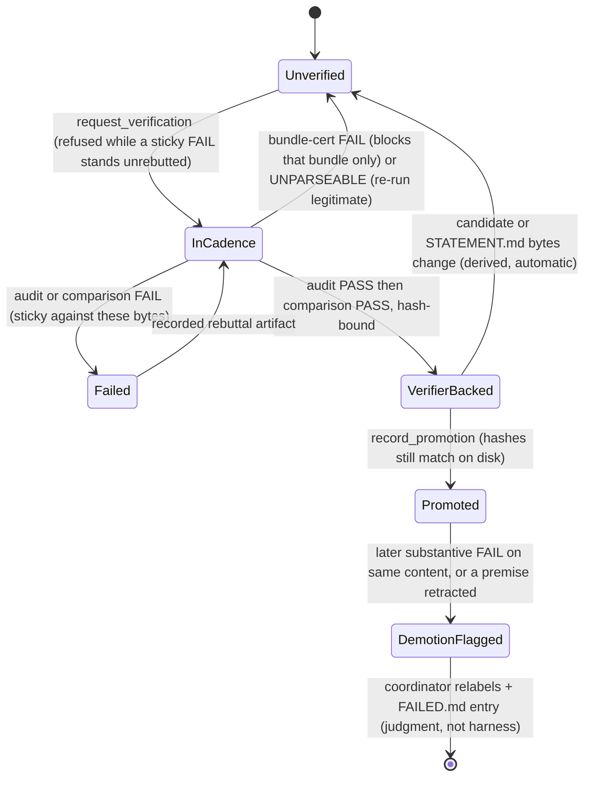
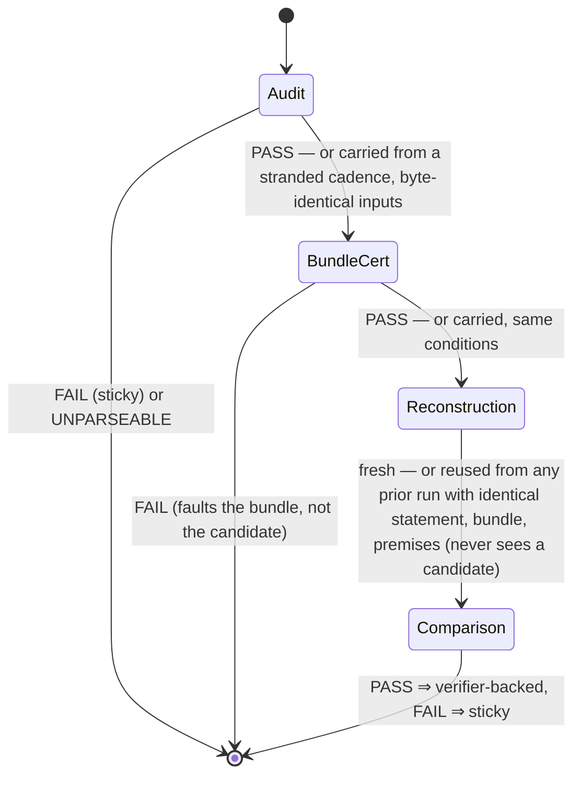
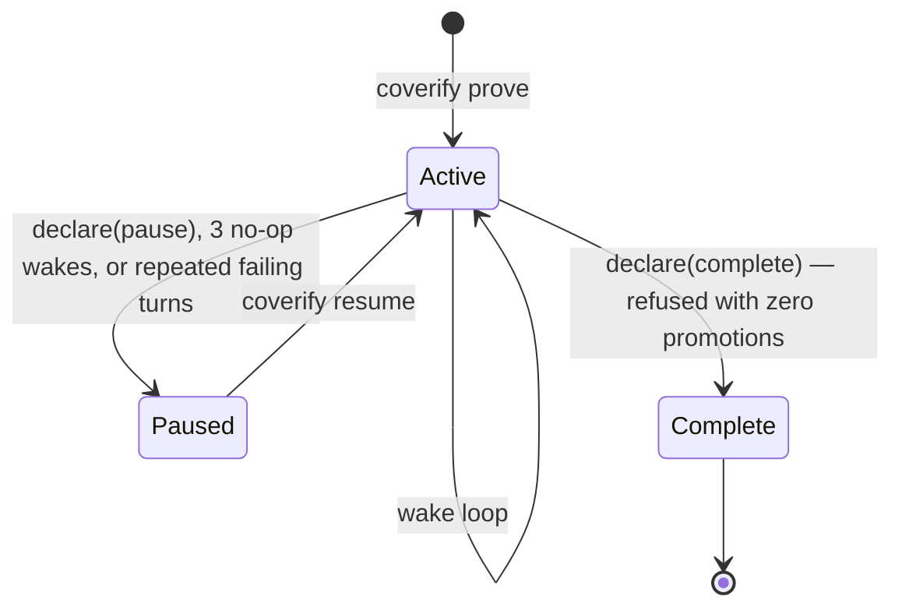

# Coverify Design

Coverify is a mechanical referee for the `math-proof-search` skill. The
skill's launcher contract
(`contract/math-proof-search-launcher.md`, canonical in this repository) is
the spec; this harness adds **zero mathematical policy of its own**. A perfectly
obedient harness-agent session running the skill and a coverify run should be
semantically interchangeable — coverify's edge is that the rules which matter
cannot be skipped, forgotten after compaction, or drifted away from.

This file is the rationale and the audit surface: what is enforced, why, and
what is honestly not enforced yet. To RUN a campaign, read `README.md` — the
commands are there, not here.

Three implementation rules follow:

1. **Every enforcement traces to a launcher clause** (conformance table
   below). Role prompts embed the launcher's fenced contract verbatim — never
   a paraphrase. The launcher is read from `contract/` in this repository
   (override: `COVERIFY_LAUNCHER_PATH`, which hard-fails when set-but-missing);
   if it is missing, coverify says so and stops — no silent fallback to a
   remembered version, mirroring SKILL.md. Because the contract is versioned
   beside the code that enforces it, `git show <commit>:contract/…` reproduces
   exactly the text a run's `launcherSha256` names.
2. **Unmapped code is semantics-invisible mechanics** (scheduler, handle
   table, wake building, journal). Any such mechanism must be removable
   without changing campaign behavior.
3. **No invented policy defaults.** No harness-invented agent ceiling
   (launcher forbids one); budget gates enforce only limits the user set —
   including recorded standing user policy: `--agent-limit` defaults to 6
   workers per campaign (Chao, 2026-08-08; `--agent-limit 0` = unlimited),
   a user decision the CLI carries, same provenance rule as the model
   defaults. `--no-computation` (opt-in per campaign) is likewise a user-set
   scope constraint, not a harness default: it refuses every technician
   dispatch so the campaign is pure reasoning (Chao, 2026-08-08), and a
   resume re-arms it from the last run-start stamp in the GATE STORE (the
   authority, never the role-adjacent journal) so a crash-resume cannot
   silently re-allow technicians. Ideation families (Chao, 2026-08-09,
   Danus-study grounding in docs/skill-feedback.md) are the same provenance
   pattern: dispatch_reasoner's optional family field routes one reasoner to
   fable (Anthropic lane: claude-cli/opus since 2026-08-09 — Fable quota exhausted; originally claude-cli/fable; Max subscription), gemini (agy/gemini-3.1-pro-high,
   Google subscription via bin/agy-oracle), or pro (chatgpt-cli/gpt-5-6-pro)
   as toolless single-shot consults — subscription CLIs, never metered APIs;
   specs env-overridable via COVERIFY_FAMILY_<NAME>. For pro, the oracle's
   server-attested served_model must equal the requested slug exactly or the
   reply is discarded as "no useful response" (Chao, 2026-08-09; issue #20 —
   ChatGPT's router measurably downgrades, and weak-model advice must not
   enter a campaign wearing a Pro label). No
   wall-clock timeouts on proof work, ever.

## Campaign state — the skill's own format

A project is a folder. The campaign directory uses the launcher's exact file
set, so a Claude Code/Codex session running the skill can resume a coverify
campaign and vice versa:

```
STATEMENT.md          verbatim statement, conventions, constraints; revisioned
CURRENT_FRONTIER.md   derived operational summary; rewritten last at checkpoints
REGISTRY.md           canonical route + claim-label index (mechanism × terminal gap)
FAILED.md             append-only closed routes with obstructions + retry-novelty bar
PROVED.md             append-only promotions with dependencies + audit provenance
PROCESS_LESSONS.md    process lessons only — the name itself carries the rule
EVIDENCE/             revision-suffixed artifacts; identity = filename (harness-written
                      artifacts are append-only; role scratch edits are instructed)
.coverify/journal.jsonl   derived mirror of the authoritative event log (observability only)
```

Gate-authoritative state lives OUTSIDE the campaign directory
(`~/.local/state/coverify/<campaign-id>/gates.jsonl`), so no role's workspace tools can
forge or erase gate records. The campaign id is stored in
`.coverify/campaign-id` (role-write-denied) rather than derived from the
directory's path: identity has to survive a rename, a restore to another
path, or a different mount, because a campaign with intact ledgers and no
gate history would otherwise re-arm the statement freeze on whatever
`STATEMENT.md` now says and lose every recorded FAIL. A campaign that has run
before but whose gate history is missing is refused rather than adopted
(`COVERIFY_ADOPT=1` on a WRITING verb accepts a new baseline
deliberately; read-only verbs never adopt, whatever the env var says, and
warn instead). One event log: every record — gate records and campaign
events (wakes, usage, notes, replayed user guidance) — appends to the out-of-tree store, and the in-tree journal is a
derived mirror written by the same append path, read only for observability
(`status`, `turns`); nothing behavioral is ever read from the role-adjacent
journal (previously standing user guidance was, a forgeable channel on
degraded-confinement platforms). Audit,
reconstruction, and comparison records are content-hash-bound (sha256 of the
candidate and of `STATEMENT.md` at verification time) — a file edited after
its PASS is no longer verifier-backed, and a statement edit without
`coverify amend` hard-stops the next run.

### Layering: core vs. the deletable measurement extension

`src/telemetry/` holds **pure consumers**: they read durable state and report
on it, and NOTHING that runs a campaign may import them.
`scripts/conformance-check.ts` guards exactly that one edge — core must not
import `src/telemetry/`, and `cli.ts` is the single module allowed to — so
`rm -rf src/telemetry`, its test files, its cli lines, and its one
`HOME_PATH_ALLOWED` entry leaves a harness that still proves theorems and
records verdicts (2026-08-09, Chao: "observation should be pure consumer").
What it loses is attribution rather than counting: worker and gate lanes still
record spend on their referencing records, verification-stage spend does not
(see `docs/journal-shape.md` rule 13).

The distinction that decides membership is WHO the noticing is for.
`observe.ts` stays in core because its queries feed the coordinator's wake
digest — noticing that changes what the campaign does next is operational.
`telemetry/` is noticing for humans, after the fact, with no path back into a
decision.

Roughly: the harness is about six times the size of the readers. Exact counts
are deliberately not written here — they drift silently and mislead the next
reader (`wc -l src/*.ts src/telemetry/*.ts`).

## Threat model

Roles are **careless, not adversarial**, and the host is expected to be a
sandbox. Confinement exists to stop the accidents that actually happened or
would silently corrupt a campaign:

1. **Runaway compute** — unsupervised or uncapped search that eats the host
   (a campaign's detached search jobs kernel-panicked saturn on 2026-08-01).
2. **Accidental destruction of campaign state** — a rewrite that erases
   closed-route history, a cited artifact edited in place, a promotion
   recorded without its verification.
3. **Silent contamination of verification** — anything that lets the blind
   reconstruction see the candidate, or a verdict be attributed to work that
   did not happen.

A role deliberately evading these mechanisms is **out of scope**: it holds
model weights and a filesystem, and no in-process check is a security
boundary against it. So findings are ranked by whether a reasonable role
doing its job could trip them, not by whether an attacker could. Where a
mechanism has a known evasion (a survivor that leaves its session and
`exec`s an unrelated binary; a symlink raced between check and use), it is
stated rather than claimed away.

## Workspace tools and confinement

Roles have no general shell. The workspace surface is pi's `read`, `ls`, and
`grep` (read-only) plus pi's `write` wrapped with an in-process scope check.
Reads are CONFINED (2026-08-09, issue #22 — measured harm: workers grepping
$HOME literature-hunted their sessions past the model context window and
leaked unrelated files into provider prompts): read/ls/grep accept only the
campaign tree plus prior-route paths declared in the user-frozen
STATEMENT.md (readRoots, workspace.ts; path normalization mirrors pi's own,
bypass-pinned in tests/read-scope.test.ts); `.coverify/` is refused
param-side and filtered result-side (harness state, and transcript reads
would breach verification blindness); every read result is capped at the
same 50k budget as run_script output, and `failed_routes` is bounded
separately at 24k so a lookup always costs less than the read it stands in
for — its first version relied on a cap that does not apply to it and could
return an entire 86 KB ledger, which is more than the read tool it was meant
to save. The read cap is a hard constant, not
env-tunable — an asymmetry with the batch caps, accepted as context-capacity
supervision, not a work timeout.
Code is a gated role, not a default: a `dispatch_technician` packet's `computation` declaration (launcher: "Use computation only for a
preregistered finite domain and stopping rule…") dispatches a *computation technician* — a distinct role whose mathematics is confined to
faithfully encoding the preregistered statement into code; it advances no
proofs and iterates only within the declared domain. Only the technician
gets `run_script` — the sole way any role executes code — and the right to
write non-prose files; reasoners and the coordinator write
`.md`/`.txt` only and never execute anything. Because dispatches are already
async handles, a technician dispatch IS the async computation: no separate
computation-handle machinery is needed for local runs. The dispatch gate
refuses a `computation` field with no concrete bounds and refuses a
technician dispatch on a tool-less CLI oracle backend. Dispatched agents' scope
is their assigned `EVIDENCE/<id>/` directory; the coordinator's is the
campaign dir *except* `.coverify/`, `STATEMENT.md`, and `PROVED.md` (deny
wins). `PROVED.md` is appendable only through the `record_promotion` tool,
which re-checks both verification stages and the content hashes before
writing. Scope checks resolve the *final* path component, so a symlink a
role plants inside its own directory is judged by its target — without that,
a deny-list entry (or the script-path confinement below) is only a naming
convention.

Web access is likewise a gated grant, and it is delegated: a reasoner whose
packet carries a `literature` question gets `literature_search`, which
spawns an external librarian CLI agent (`COVERIFY_LITERATURE_CMD`, default
`agy` print-mode with live web search) through the *same* supervision as
`run_script` — shared wall limit, RSS cap, whole-tree kill, exit reaper,
abort signal — and archives the full compiled report as `literature-<n>.md`
evidence (self-attested provenance, like `fable-review`). That name is
harness-owned: no role may author or edit a `literature-<n>.md`, so a
citation always corresponds to a search that actually ran. The librarian runs under the role's write
sandbox plus a narrow allowance for its own state directories
(`COVERIFY_LITERATURE_STATE_DIRS`, default the `agy`/Gemini dirs) — never
`~/.claude`, `~/.codex`, or `~/.config`, which hold settings and hook files
that execute later and coverify's own OAuth store. No campaign role ever
touches the network itself; `literature` exists only on reasoner packets and `computation` only on
technician packets, so the role that reads the web structurally holds no
code tools; the coordinator and all
verification-cadence roles have neither grant, keeping blind reconstruction
uncontaminated.

`run_script` runs a batch of 1–8 script files (`.py` under python3, or
executables) concurrently by argv — no shell, so detach primitives
(setsid/nohup/disown, tmux -d, screen -dm) are not even expressible. Each script
must additionally resolve inside the role's own write scope, so a host
interpreter (`/bin/sh -c …`, `python3 -c …`) cannot be named as the script
and hand the shell back. Each run is its own process group; the whole batch
shares one time limit and one combined RSS cap (`COVERIFY_RUN_MEM_MB`,
default 4096). At batch end (or when a cap trips) the harness kills the
groups and then sweeps `ps` for survivors — processes still descended from
the batch, sharing its groups, or still running one of its script paths —
because a child that calls `setpgrp()` and is reparented to pid 1 is
invisible to a group kill alone. The sweep matches whole argv tokens naming the batch's own script paths, plus
its working directory when that directory belongs exclusively to the batch (a
dispatched agent's evidence directory) — which is what catches a helper
launched in a new session running a different file there. On a shared
directory (vanilla pi through the extension) the directory is not matched:
killing by it would reap other agents' and tools' processes, so that recall is
given up deliberately. A survivor that
leaves its session *and* `exec`s a binary naming nothing in the workspace
would evade it; the technician is a supervised role, not an adversary, so
that residual is stated rather than claimed away. If `ps` itself fails, the batch is killed and the failure
reported — the cap never silently disappears. The harness also reaps live
batches on `exit`/SIGINT/SIGTERM/SIGHUP and on `cancel_agent`'s abort
signal, so operator Ctrl-C or a crash takes the compute with it instead of
leaving detached groups with no watchdog. The batch is intra-turn concurrency for one
technician; harness-level async computation handles remain the roadmap item.
The scoped write tool additionally enforces ledger integrity: `FAILED.md`
rewrites must preserve the existing content as an unchanged prefix
(launcher: append-only), and `literature-<n>.md` librarian reports are
immutable. Enforcement tests live in `tests/` and run in `bun run check`. Script writes are OS-sandboxed on macOS (`sandbox-exec`,
deny-default writes; reads unrestricted) to the same scope. On non-darwin
platforms the same scope is enforced via `@landstrip/landstrip`
(Landlock + seccomp, deny-default writes and networking); only if the
landstrip binary is missing does confinement degrade to instructed-only,
announced loudly at run start. (A campaign placed under the system
temp tree is inside the sandbox's blanket temp allowance — keep campaigns in
real project directories.) Long or parallel computation goes through the
scheduler front door, per the launcher.

## Runtime shape

```
cli.ts           prove / resume / stop / status / spend / outcomes / limits / turns /
                 say / amend / config / login / logout
                 (the operator surface — the one module allowed to read telemetry/)
campaign.ts      state layer: init, revisions, append-only evidence, resume bundle
launcher.ts      load + extract the fenced launcher contract (no fallback)
roles.ts         role charges + LIBRARIAN_CHARGE (all coverify-authored role text; no re-exports)
sandbox.ts       OS supervision + confinement mechanics: reaper, sandboxing, supervise() batch runner
workspace.ts     the role tool surface: run_script, librarian, failed_routes, write rules, readRoots/confineReads
knobs.ts         every env knob declared once; feeds the reader, the generated usage text, and the run stamp
failed-index.ts  FAILED.md entry parsing + lexical ranking behind failed_routes
backends.ts      subscription CLI transports (claude/codex/chatgpt/agy) + served-model attestation
providers.ts     model providers, per-role specs + ideation families, runRole, harness sessions
coordinator-tools.ts clause-mapped coordinator tool surface (coordinatorTools(deps) factory)
claude-bridge.ts pi-claude-bridge as a pi-ai provider (subscription tool loop)
gates.ts         dispatch gate, idea-gate ledger, verification state, promotion
cadence.ts       the two-stage verification cadence (the clause-dense core)
harness.ts       handle table, event loop, wakes; the only persistent process
observe.ts       records + noticing queries: run-config stamp, ledger history,
                 refusal events + unaddressed-refusal noticing, wake bookkeeping
                 (prompt-surfaced noticing; never gates, dispatches, or ledgers)
pi-extension.ts  interactive-pi boundary layer: supervised run_script in
                 place of raw bash (phase 3; never writes trusted state)

telemetry/       THE MEASUREMENT EXTENSION — deletable. Core imports none of it
                 and cli.ts is the only composition root, so `rm -rf
                 src/telemetry` plus its cli lines leaves a harness that still
                 proves theorems and records verdicts, and stops counting
                 tokens. Verified, not assumed: doing exactly that typechecks
                 clean and passes its full suite.
  schema.ts      the span contract: run -> wake -> dispatch -> stage -> provider_call
  context.ts     JournalTelemetryContext: spans -> role-call leaves, with the
                 parent edges read off the ancestry rather than copied per record
  spend.ts       per-lane/role/model tokens; refuses cross-meter sums
  outcomes.ts    what the spend bought; refuses the on-path fraction below 50%
                 premise coverage
  limits.ts      rate-limit occupancy and burn rate (the binding constraint)
  turns.ts       per-turn telemetry derived from the pi session trees
  shared.ts      the readers' shared load-and-filter, M and median
```

Observability layering: the **pi session JSONL trees**
under `.coverify/sessions/` are the authoritative per-agent transcripts
(full content, branchable, crash-survivable) and the single transcript
store — per-turn telemetry (sizes/usage/gaps/stopReason) is a pure
function of the stored messages, derived on demand by `coverify turns`
(src/telemetry/turns.ts, read-only) rather than maintained as a sidecar; the
journal remains the event index. A campaign directory is now openable in
three harnesses: coverify headless, the raw skill in Codex, and interactive
pi with `src/pi-extension.ts` loaded.

- **Coordinator**: resident across wakes — matching how the skill runs in a
  live Codex/Claude Code session — as a durable pi AgentHarness session
  (JSONL tree under `.coverify/sessions/`). At the context cap
  (`COVERIFY_COORDINATOR_CONTEXT_TOKENS`, default ~300k) it **compacts in
  place** — the launcher's anticipated "context compaction", with the
  summary explicitly subordinated to the ledgers and the restart-rule
  reread instruction delivered in the next wake message (kill-and-rebuild
  remains the fallback for non-compactable sessions). Continuing wakes
  receive only new reports + status digest; the full resume bundle is sent
  on (re)build. Sole ledger writer. Decisions must still be externalized to
  the ledgers every wake — residency is continuity of soft context, never a
  substitute for durable state.
- **Reasoners and technicians**: fresh AgentHarness sessions (durable JSONL
  transcripts, session id = handle id = prompt_cache_key); packet in, finite deliverable out;
  write access only to assigned `EVIDENCE/` paths.
- **Verifiers**: the stage-1 hostile auditor, bundle certifier, stage-2
  blind reconstructor, and comparator are fresh instances; the harness
  withholds the candidate from the reconstructor (platform-enforced), while
  the keyIdeas/allowedSources bundle is coordinator-authored and gated by
  certification (see honesty ledger). The journal records supplied inputs,
  visibility, and model family per call.
- **Dispatched work is stoppable through one verb**, whatever runs it: a
  handle carries `stop()`, which aborts a pi session, kills a spawned CLI, or
  makes a composite verification cadence stop recording. `cancel_agent` and a
  campaign declaration no longer ask what substrate a handle is — previously
  they called `session?.abort()`, which was a silent no-op for every
  CLI-backed role, so an in-flight `claude -p` audit outlived a pause, billed
  a full run, and landed its verdict nowhere. Spawned CLIs are also registered
  with the exit reaper and clean up their temp directories, so a dying harness
  takes them with it.
- **One writer per campaign**: a run holds `.coverify/lock.json` for its whole
  life and releases it on every exit path. Handle ids come from a counter each
  process computes once, `GateStore` snapshots its records at construction, and
  evidence directories are handed out by name — so two runs would mint the same
  `r001`, give one directory to two agents, and each gate against records
  missing the other's FAILs. A lock whose holder is gone is taken over and the
  takeover journaled; an idle campaign parked on a handle looks dead, which is
  exactly when a second run gets started by accident.
- **Delivery is recorded, not assumed**: showing a report to the coordinator
  is a second obligation after persisting it, and it is journaled as a
  `delivery` record only once the turn that showed it succeeded. A wake that
  throws, or a run that ends at its wake limit, therefore re-offers the report
  at the next wake or the next run — without it, a persisted completion is
  excluded from the lost-work list and no coordinator ever sees it.
- **Standing user guidance is replayed**: delivered `coverify say` directives
  are journaled and re-sent on any prompt that rebuilds context (first wake of
  a run, and after an in-place compaction), because a delivered message
  otherwise lives only in the coordinator's conversation and silently stops
  applying at the next restart.
- **Durability is at settle, not at harvest**: when a dispatch's promise
  settles, its report is written to `EVIDENCE/<id>/report.rN.md` and its
  completion journaled immediately; the settled queue then carries only a
  pointer for delivery to the coordinator. Three defects (pause, the
  wake-limit exit, the declaration return) each lost finished work because an
  exit path skipped a harvest step — with the write at settle time, no exit
  path can lose a report. A report that arrives after `cancel_agent` is still
  written, journaled as a late artifact rather than a second completion.
  In the other direction, a `cancel_agent` arriving AFTER the handle settled
  is refused as a no-op (the queue still holds it; harvest is at the next
  wake), so work that finished mid-turn is never cancelled out from under the
  harvest — the same rule `declare_campaign_state` gets by harvesting first.
- **Handles are the async primitive**: worker/technician dispatches and
  verification cadences are handles in one table; completions wake the
  coordinator — no polling. Gate critics run synchronously inside the
  coordinator's tool call (single-shot verdicts, short).

## State diagrams (derived, never stored)

The system is full of state machines, but no state is ever stored — there is
no status field anywhere. Every "state" below is recomputed at the moment of
decision from two things: the append-only gate records and the current bytes
on disk. That is deliberate, three times over. A stored status would be one
write away from forging `verifier-backed`, while the records are hash-bound
and live out of tree. A stored status would go stale silently — here, editing
a promoted candidate's file *is* its demotion, because the derived state
stops matching without anyone having to notice and update a field. And
several "states" are properties of the whole history, not of the current
node: a substantive FAIL sticks to content across renames, and stranded-ness
is "dispatch without completion", both queries over the log. The diagrams
are documentation of those queries; the code they describe is
`verificationState`, `checkPromotion`, `priorReusableRecord`,
`promotionsNeedingRetraction`, and the handle table.

A revision's life, keyed on (candidate content hash, statement hash) — a
repair is deliberately **not** a transition: new bytes are a new machine, and
the old machine's FAIL stays on record against the old content forever:



Inside one verification handle, the cadence is linear with early exits; the
carry-forward edges are the information-flow policy from the review record:



Every dispatch (worker, gate, verification) is one handle:

```mermaid
stateDiagram-v2
    [*] --> Live: dispatch record, then registerHandle starts the work
    Live --> Settled: final report, infrastructure failure, or cancel_agent
    Settled --> Delivered: completion record at settle time; delivery record after the wake that showed it
    Live --> Stranded: process death (dispatch record, no completion record)
    Stranded --> [*]: restart notes it; a stranded verification's stage PASSes are carry-forward eligible
```

The campaign itself:



## Conformance table

| Mechanical enforcement (code) | Launcher clause |
| --- | --- |
| `STATEMENT.md` written once; new revision only via explicit user amendment; completion evidence invalidated | "Fix its revision before search; only an explicit user amendment may replace it…" |
| Campaign file set; harness-written evidence is revision-suffixed (`newEvidencePath`), and `FAILED.md` prefix-append plus `literature-*.md` immutability are enforced (workspace.ts: `APPEND_ONLY_LEDGERS`, write wrapper). Other in-place edits under `EVIDENCE/` are contract-instructed, not blocked — a role can still overwrite its own scratch artifact | "Durable campaign state" bullets |
| Read scope (workspace.ts: `readRoots`/`confineReads`): roles read only the campaign tree plus STATEMENT.md-declared prior-route paths; `.coverify/` refused param-side and filtered result-side; 50k per-result cap. Confinement, not emulation of platform isolation — recorded honestly in the ledger below (prose roles enforced; scripts instructed-only) | "Use stronger platform enforcement if available; do not emulate it with a second proof-state system." / blindness recording clause |
| Dispatched agents get no ledger-write capability; only assigned evidence paths | "The coordinator is the sole ledger writer; workers… write only assigned evidence artifacts" |
| Resume bundle = STATEMENT + FRONTIER + full REGISTRY.md + full PROCESS_LESSONS.md, launcher embedded verbatim in the system prompt (never FAILED.md, PROVED.md, or EVIDENCE/ wholesale) — supplied on every coordinator (re)build **and re-supplied on the wake after every in-place compaction**, so both halves of the clause are enforced, not instructed | "After restart or context compaction, reread…" |
| Claim-label vocabulary quoted verbatim into the ledger templates at init; label discipline and weakest-premise inheritance are contract-instructed model judgment | "Claim labels — literal, never inflated" |
| Dispatch schema requires the FAILED.md check field (`no close prior route` / `closest is X; differs because…`) | "Before every route, materially changed retry, or variant, check `FAILED.md`…" |
| Worker packet schema requires a finite mathematical deliverable; the deliverable-or-precise-gap report form is charged in the role prompt, not parsed | "Every exploration agent must return a proved lemma, explicit construction, counterexample/certificate, a precise failing implication with evidence, or — for a proposal packet — a set of gate-ready mechanism proposals…" |
| No harness timeouts on proof/audit/reconstruction work (the per-run_script batch cap is surfaced in the tool description and env-tunable; the 50k read-result cap is context-capacity supervision, not a work timeout; consult/search CLIs — agy-oracle, the chatgpt oracle, the librarian — run with 7-DAY supervision bounds: hang protection, never work limits (user decision: no timeouts on model thinking, Chao 2026-08-09); only the run_script batch cap remains a real wall, as compute host-protection) | "Do not impose a coordinator-created elapsed-time limit…" |
| Code tools (`run_script` + non-prose writes; workspace.ts: `PROSE_EXTS`) exist only on a technician dispatched with a computation declaration with concrete bounds; dispatch gate refuses thin declarations; coordinator is prose-only; the dispatch returns the REGISTRY.md launch record (workload, limits, output paths, cancellation) | "Use computation only for a preregistered finite domain and stopping rule yielding a small witness, certificate, or table." / "Never run unsupervised detached compute." |
| Mechanism identity for gate keys is normalized (trimmed, whitespace-collapsed, case-folded), so retyping a mechanism neither evades the wave gate nor discards an IDEA PASS already earned | "Do not allow recursive subagent fan-out or broad concurrent exploration of a route before the parent mechanism receives `IDEA PASS`…" |
| Wave gate: a second **concurrent** worker on a mechanism requires `IDEA PASS` on file; sequential retries get an advisory reminder, not a refusal (that judgment is the coordinator's); single first-wave scouts exempt | "Do not allow recursive subagent fan-out or broad concurrent exploration of a route before the parent mechanism receives `IDEA PASS`…" |
| Verification = stage 1 (fresh hostile audit) then stage 2: bundle certification (fresh agent sees candidate + bundle; leaky bundle refused, same-bundle retry hash-blocked) → blind reconstruction (no verdict) → fresh comparison carrying stage 2's verdict with the contract's match semantics; all outputs saved as citable EVIDENCE artifacts, hash-bound; a reusable reconstruction is bound to the candidate hash as well as its own artifact hash, so a repaired candidate always gets a fresh one | "Verification cadence" 1–2 (2026-07-31 revision): bundle certification, "a fresh comparison agent…", explicit PASS/mismatch semantics |
| Anti-verdict-shopping: a substantive audit/comparison FAIL blocks re-verification of that content — matched by candidate hash, so copying the bytes to a new filename inherits the FAIL — unless a recorded rebuttal artifact is supplied; every attempt stays on record. Also in its CONCURRENT form: a second cadence on a candidate hash a live cadence is already running is refused, because `verificationState` takes the LATEST record per stage, so two overlapping cadences would let the slower PASS land after the earlier FAIL and make the revision promotable | "A substantive FAIL from any stage stands… Do not rerun a failed stage on an unchanged revision in search of a PASS" |
| Any content change ⇒ every stage reruns, reconstruction included: the contract says a load-bearing repair must "rerun a fresh hostile audit and then a fresh reconstruction. Never reuse a verifier response that influenced the repair", and the comparator's FAIL is quoted into the wake that prompts the repair. Reuse is limited to a re-run on the byte-identical candidate (a protocol or infrastructure failure): an audit or bundle-cert PASS carries forward (`priorReusableRecord`, requireStranded) only when every input hash (candidate, statement, promoted premises, declared dependencies / bundle) matches, its saved artifact is byte-unchanged, **and** its own cadence is stranded — a verification dispatch with no completion record, or one whose completion is itself `failed` or `cancelled`; the journal's definition of an infrastructure failure, widened by that second clause so a byte-identical re-run after a restart does not re-pay every stage (campaign 2026-08-01 v033/v035; lin3cut 2026-08-09). A PASS from a completed cadence is never reused, so a rebuttal challenge or duplicate re-request reruns every stage fresh; the comparison, being the final verdict, is never reused at all. Carrying stages forward for a certified non-load-bearing diff is legal but needs a fresh delta auditor's PASS, which is not built (roadmap) | Revision-impact rules |
| `record_promotion` is the sole writer of `PROVED.md` (direct writes OS-denied); legal only when both stage records exist for the exact revision with matching content hashes; entry carries dependency identities, audit-artifact citations, and the verified candidate's content hash. The promoted statement text itself is coordinator-authored and not machine-checked against the candidate — see the honesty ledger | "Promotion records the revision and dependency identities plus every audit…" |
| Campaign ends only by explicit `declare_campaign_state`; "complete" refused with zero promotions on record; an idle wake gets a nudge, and 3 consecutive no-op wakes trigger an operational *pause* (never a completion) as spend protection | "Do not mark it complete until the final result passes the full cadence…"; "Failed attempts… are not permission to return"; "Pause is operational state" (pause stops further wakes; live agents are not force-aborted — use cancel_agent) |
| Harvest before judgment: worker reports are saved to EVIDENCE/ and completion-recorded before any model sees them; checkpoint ordering itself is contract-instructed, not enforced (struck as over-constraint, 2026-07-31 review) | "Checkpoint and learning loop" |
| Campaign loop persists across restarts until user stop or completion; `declare_campaign_state` interrupts live agents and cancels their computations unless `continueSupervised` is set (the contract's "explicitly authorized to continue under supervision"), then stops after the wake | "The initial resolution request remains authorization…" |
| Journal records each audit's supplied inputs, visibility, model family, and instructed-vs-platform-enforced restrictions | "Every audit records the supplied inputs, workspace/tool visibility, model-family provenance…" |
| No agent-count ceiling; budget gate enforces only user/workspace/runtime limits | "Do not impose a fixed agent-count ceiling… scaling to available concurrency and any explicit user, workspace, or runtime limits" |

Judgment stays with models: route selection, packet composition, inline
derivations when the coordinator judges them cheaper than a packet, gate and
audit verdicts, struggle rulings, promotion decisions, lesson content, and
whether a sequential retry constitutes a "follow-up wave" needing the gate.
Mechanics-only (rule 2): handle table, event-driven wakes with ambient status
digests, journal, out-of-tree gate store, write sandbox, verdict-line parsing,
version stamps, and the user message inbox (`coverify say` →
`.coverify/inbox.jsonl`): verbatim transport of user guidance — steered
into the coordinator's running turn (a ~1s inbox watcher over session
`steer`), else delivered at the next wake; the headless analog of typing
to an interactive skill session. The inbox lives under `.coverify/`, which
every role's write scope denies, so a role cannot forge user guidance;
delivery is journaled and at-least-once (a message steered into a turn
that then fails redelivers at the next wake), and a statement change still
requires `coverify amend` (the delivered block says so).

**Honesty ledger** (launcher: record instructed-vs-platform-enforced): the
candidate is withheld from the reconstructor by a PROMPT CHECK, not by the
platform: `assertCandidateWithheld` (gates.ts) refuses to dispatch when the
rendered prompt contains the candidate with whitespace collapsed, which catches
the leak that occurs in practice (a bundle quoting the proof) and does not stop
a reconstructor reading the file — the default `codex-cli` backend runs
`--sandbox read-only`, which confines writes and leaves reads open, and role
subprocesses do not go through `sandboxedArgv`. Its isolation from the
candidate is therefore instructed, and this ledger said "platform-enforced"
until 2026-08-10. Write confinement IS platform-enforced, but only for
`run_script` and the librarian, which are the calls that go through the
sandbox; the prose write tool is guarded in-process by `assertInScope`.
The bundle (`keyIdeas`/`allowedSources`) is
coordinator-authored but now passes a mandatory certification by a fresh
agent before stage 2 runs (contract-required; the certification itself is
model judgment, recorded as such); `declaredDependencies` remains
instructed-only, mitigated by giving the stage-1 auditor PROVED.md. The
promoted statement text in `record_promotion` is likewise coordinator-
authored and unverifiable by the harness — nothing mechanically checks that
it is what the candidate proves, so PROVED.md entries carry the verified
revision and its content hash and an over-claim is auditable against that
exact artifact, not prevented. Re-verification after a substantive FAIL
requires a rebuttal artifact to exist, but its content is never read or
shown to a verifier; the anti-shopping property is that every attempt stays
on record and the latest verdict per stage decides, not that a determined
coordinator cannot resample.
Non-darwin platforms: write confinement OS-enforced via landstrip
(Landlock + seccomp), degrading loudly to instructed-only when the binary
is absent. `claude-cli/*`
verdict roles run as `claude -p` subprocesses: fresh process per call, run
in an empty temp directory, but the CLI carries its own tools (file read,
web search) — their isolation is instructed-only, and the journal's
modelFamily field discloses the backend per call. A `claude-bridge`
coordinator runs its tool loop through the Claude Agent SDK
(pi-claude-bridge): the bridge starts Claude Code with built-in tools
disabled and strict MCP config, so the model's whole tool surface is
coverify's own (workspace + gate tools) — confinement is unchanged,
though tool-disablement there is SDK-flag-enforced rather than
OS-enforced. Concurrent bridge sessions cross-contaminate (observed in
testing), so claude-bridge is coordinator-only, refused at preflight for
every other role.

## Retry stack (bounded, layered)

Transport failures are absorbed at two layers with a documented ceiling:
the pi-ai patch retries a mid-stream transport death inside the provider
(PI_CODEX_MIDSTREAM_RETRIES, default 2 → ≤3 stream attempts per prompt
call), and the ask-boundary wrapper retries the whole turn
(COVERIFY_RETRY_MAX, default 3 → ≤4 turn attempts). Worst case is
therefore ≤12 stream attempts per turn with exponential backoff at both
layers; quota/billing errors are never retried at either. cancel_agent
interrupts the stack between attempts (the wrapper's backoff honors the
session's abort signal). The provider layer is a local bun patch
(patches/) carried while upstream earendil-works/pi#7820 is open — drop
it when pi ships provider-level stream retry.

## Efficiency commitments

Verify at trust boundaries (promotions, resolution claims), not per
micro-fact; gate before the wave; finite deliverables, never clocks; the
FAILED/REGISTRY indexes stop re-funding dead routes; budgets enforced at
dispatch; every role instance is fresh — workers get one packet each, and
fresh instances are mandatory where they buy trust (critics, verifiers).

Measured, not asserted: `failed_routes` (indexed lookup over FAILED.md, bounded
at 24k) exists because a whole-ledger read is not paid once — a 31 KB FAILED.md
read sits in the session and is re-presented on every later turn, which measured
40.4M tokens presented in the reasoner lane, ~1.5% of credits (2026-08-10). It
adds no channel, no file, and no contract surface: it is a cheaper way to read a
ledger the role could already read.

## Observability

Usage records tokens and model identity, never dollars (2026-08-09). Every
role runs on a subscription lane (`ROLE_DEFAULTS`), so a provider-reported
price — pi's per-message cost, `claude -p`'s `total_cost_usd` — is notional
list price rather than money spent, and a field named `costUSD` asserted
otherwise on every record that carried it. The removed field had also been
lying in three narrower ways: summed cadences of unpriced CLI stages emitted
a concrete `costUSD: 0` over millions of tokens (115 such records in the
2026-08-08 fleet, worst at 7,053,222 tokens), `campaignTurns` read a
flattened `costUSD` the session log never contains — so every priced
coordinator session read as unpriced — and the partial-sum marker added to
paper over heterogeneous backends only widened the surface. Records now
carry token counts plus `modelFamily` (with `servedModel` attestation where
a backend gives one); a reader wanting dollars applies a rate table at read
time, where "these are list prices" is an explicit assumption. Optional
fields stay absent unless a backend reported them: a measured `reasoning: 0`
and "no backend reported the field" are different records.

Cache-write spend is unmeasurable, and the provider prices did not fix it:
`cacheWrite` is hardcoded 0 upstream (pi #6469) and measures 0 across all
4,117 pi-path messages in the fleet, with pi attributing $0.00 to it — so
the provider-computed price inherited the same blind spot a read-time rate
table would have. Note it as a known floor on any cost derivation rather
than trusting a number that silently excludes it. `claude-cli` does report
`cacheWrite` correctly (178/178 records); `codex-cli` never does (0/382).

Reported-model identity (#21 P3, 2026-08-09): verdict records carry
`reportedModel` when the backend states what actually answered —
`claude-cli` reports it in its JSON (`modelUsage`/`canonicalModel`);
`codex-cli` emits no model echo in its JSONL (verified 2026-08-09), so it
stays undefined rather than fabricated; `chatgpt-cli` reports a
server-attested `served_model`, which is stronger and drives `modelFamily`
itself (issue #20). The companion query `modelSubstitutions()` surfaces
disagreements in the wake digest — journal-only, never a refusal: the
harness states the fact that a cross-family audit may have run same-family
and leaves the judgment to the coordinator (rule 3).


Four readers make the journal's measurement fields answerable rather than
merely written; `docs/journal-shape.md` states the rules they enforce, by
number, and the code cites them. `coverify spend` reports per-lane and
per-role token totals
and refuses, by construction, the three errors the 2026-08-09 study made:
it never cross-sums meters (different provider accounts are not one
currency), never counts a roll-up (flagged or historical), and never sums a
cumulative snapshot. It prints no grand total, deliberately, and names its
floors: a lane that does not report `reasoning` or `cacheWrite` yields a
LOWER BOUND, bounded for cache writes by the empirical 0.25–2.5 write/read
ratio rather than read as zero.

`coverify outcomes` is the other half of that ledger, and the reason the
cost tables mean anything: stage verdicts, repair-loop depth per revision,
and spend split by whether the revision ever promoted. A cost number alone is
non-diagnostic; this is what it divides by. It computes issue #38's on-path fraction — the share of standing promotions
on a terminal result's transitive premise path — but REFUSES to divide below
50% premise coverage. Premises are optional and absent on 54 of 64 promotions
across the seven campaigns, and a premise-less promotion is trivially its own
terminal, so a fraction computed there measures the unrecorded edge rather
than the misdirected work. The report says which, and why.

`coverify limits` reports the constraint that actually ends campaigns.
Subscription runs are not metered in dollars — credits are purchasable
overage and this account consumed none — so what binds is a rolling window.
It joins the journal to codex's own rollouts, exactly on the recorded
providerSessionId/backendCwd where those exist and otherwise by coverify's
temp-dir signature within the campaign span widened by a day either side (as
the report itself discloses), reported as the inference it is.
On bet-transversal: peak 94% of a 7-day window, 16.0 points/hour at the
fastest sustained burn, ~0.4h of headroom left.

`coverify turns` derives per-turn telemetry — message sizes, per-request
usage, inter-turn gaps, stopReason — directly from the pi session JSONL
trees, as a pure function of the stored messages rather than a sidecar that
could drift from them.

An HTML timeline (`coverify trace`) and a corpus-summability checker
(`coverify corpus-check`) existed and were removed 2026-08-10: the timeline
was a second rendering of what `status` and the journal already say, and the
corpus check was written against a foreign log shape. The four readers above
are the whole measurement surface.

All four are read-only by construction — they consume harness audit metadata
and never write campaign state, so they cannot change campaign semantics
(rule 2). They also work on a live campaign; in-flight dispatches simply show
as "no completion recorded".

## Analytics: query in place

The authoritative event corpus is small by construction (~1.4 MB across
all campaigns ever, measured 2026-08-08), so analytics is a convention,
not infrastructure: DuckDB directly over the out-of-tree JSONL
(`read_json_auto(..., format='newline_delimited', union_by_name=true,
filename=true, sample_size=-1)` — drift-tolerant, cross-campaign by filename,
zero sync, no second trust domain; `sample_size=-1` is load-bearing, since
schema detection samples only the first 20k rows per file and older campaigns
predate fields like `usage.meter` and `runId`). The four readers above
already compute the totals that matter, and they refuse the sums a hand-written
query gets wrong, so reach for DuckDB for one-off questions, not for cost
figures. Derived stores were reviewed and rejected (synced SQLite: schema drift
yields confidently wrong answers; OTel-shaped events: a one-way projection
if ever wanted, never the authoritative shape). House rule from the same
review: every new record ships with the derived query that makes it
actionable — an unread log is not an audit trail (see issue #21).

## Skill feedback

Candidate improvements to the skill discovered during this design are
tracked in `docs/skill-feedback.md`. Policy: do not edit the canonical skill
until this harness has run a real campaign; the only planned zero-risk edit
is a note that a conformant harness exists and campaign directories are
interchangeable.

The coordinator's "no inline proof work" rule cites the launcher directly (it
is a launcher clause, not harness policy). With a resident coordinator the
rationale is also structural: inline proof work pollutes the long-lived
judgment context and accelerates compaction.

**Honesty notes from the 2026-08-02 runtime-migration review:** (1) the
compaction summary is produced by pi's generic summarizer
(`SUMMARIZATION_SYSTEM_PROMPT`), a distinct stateless utility call outside
the contract; it enters the coordinator's context as soft user-role text
with a fixed ~20k-token verbatim tail, is billed at the coordinator's model
and thinking level, its spend is counted into the usage journal via the
compaction entry, and the ledgers remain authoritative (re-supplied in the
next wake). (2) Session JSONL trees under `.coverify/sessions/` are full
transcripts on disk. The pi read tools now refuse and filter `.coverify/`
(2026-08-09), so the transcript-read block is tool-surface-enforced for
prose roles — but a technician's run_script executes at the OS level where
both sandbox backends deny writes only, so against a script the block is
(instructed only), not (enforced). Blind roles remain toolless.
(3) Prompt purity of harness sessions is by construction — AgentHarness
uses the `systemPrompt` string verbatim with no hooks registered and empty
resources — verified against pi source at 0.83.0; re-verify on pi upgrades.

## What the design reviews settled

Five adversarial/measured reviews (2026-07-31 through 2026-08-08) are in git
history. What survives here is only what still binds.

**Reuse soundness is information-flow control, not memoization.** A stage
record is reusable iff its output provably could not have influenced the
request now presenting these inputs. The reconstructor is structurally blind
to candidates, so its reuse crosses completed cadences with `candidateHash` as
an influence-tracking key (not a disclosed input); verdict stages see the
candidate, so their reuse is confined to stranded cadences; the comparison IS
the verdict, so it is never reused. A "verified computation cache" framing —
every stage a memoized pure function of its disclosed inputs — was rejected as
unsound on the contract's central example: pure input-memoization reuses a
reconstruction across a repair, exactly the bug removed in 6997036. For the
same reason there is no declarative stage table driving a generic runner: it
would teach "reuse key = inputs", the wrong invariant.

**An unparseable verdict reply is `UNPARSEABLE`, never `FAIL`.** A protocol
failure must not arm anti-verdict-shopping nor permanently hash-block a
legitimate bundle (a garbled certifier reply used to be a permanent trap).

**The user `--agent-limit` counts workers (r*/t*) only** — judge handles
(g*/v*) do not consume the workers' budget; the handle-kind discriminator is
load-bearing for both that and the wave gate.

**Standing refusals.** No second proof-state system and no second memory
store: the launcher's ledgers are the memory, and derived stores (synced
SQLite, a daemon graph store, agent-memory packages) were each rejected on
that ground. Git auto-commit of campaigns was rejected as a second versioning
system; git stays a user convention. Per-lemma admission verification with a
fact DAG was rejected on measurement (composition already works at promotion
grain; 85% of the compared system's facts lay outside the answer's dependency
ancestry). Glossary mechanics were rejected likewise — reconstruction plus
comparison already verify convention agreement semantically.

**Open, measured.** Campaign 2's journal showed workers idle ~59% of the
worker window behind serialized coordinator judgment — measured before the
async-verification handle, so re-measure via the idle metric (issue #15)
before pipelining dispatch. Left honest rather than fixed: key-idea paraphrase
risk and idea-gate mechanism-string keying remain model judgment.

## Planned capability: CLI coding agents (design reserved, not built)

Workers will be able to run coding experiments through the subscription
harnesses directly — `claude -p` / `codex exec` — via a harness-provided
`run_coding_agent` tool. Shape decided in advance so nothing has to move:

- The harness spawns the CLI as a supervised child process (never through the
  worker's sandboxed tools, which would block the CLI's own state writes),
  cwd'd to an experiment directory inside the worker's `EVIDENCE/<id>/`;
  output is saved as an evidence artifact; the journal records the model
  family and that provenance is self-attested — the exact pattern
  `fable-review` already uses.
- Base commands are configurable (`COVERIFY_CLAUDE_CMD` / `COVERIFY_CODEX_CMD`)
  so flag drift in the CLIs never requires a harness release.
- Bonus this unlocks: `codex` is a demonstrably different model family, so
  the launcher's independent different-family audit can run on subscription
  rather than API pricing; `fable-review` (file-path interface: CANDIDATE
  STATEMENT DEPENDENCIES EVIDENCE_DIR) plugs into the EVIDENCE layout as-is
  for the Anthropic-side outside review.

**Schema-forced role returns** were rejected on measurement (2026-08-02):
`parseFirstLineVerdict` is 11 lines with two call sites and misfired zero times
in ~109 verdicts, and the CLI-oracle roles have no tool loop, so forcing schemas
would add a second verdict path rather than replace the parser. Revisit on
evidence — a single UNPARSEABLE in a journal, or a campaign where the
coordinator repeatedly bounces workers for status-report output. The second is
currently unmeasurable (coordinator rejections are not journaled), which is the
cheaper thing to fix first.

## Status / roadmap

- [ ] **Split the harness from its dev instruments.** `src/telemetry/` currently
      holds two kinds of code separated by nothing but the word "telemetry":
      `context.ts` and `schema.ts` RECORD, in-process, during a campaign, and
      are part of the harness; `spend.ts`, `outcomes.ts`, `turns.ts` and
      `shared.ts` READ, after the fact, and exist to make coverify better
      rather than to make a campaign run. The recorder can never be a separate
      program -- it has to live inside the process making the calls -- but the
      readers could be, and a published journal format is what would let
      anyone write their own.
      The blocker is one import: `outcomes.ts` takes
      `promotionsNeedingRetraction` from `gates.ts`, because "what counts as a
      standing promotion" is a predicate BOTH layers ask -- the harness to
      decide, the reader to count -- and duplicating it would let the two
      answers drift. So the journal is not merely a log the harness writes; it
      is a format with predicates over it, and that pair is the publishable
      artifact. Sequence: declare the field table (writer and reader named per
      field, `docs/journal-shape.md` is the start), move the journal predicates
      to the format side, then the split costs nothing.
      One caveat against a clean cut: `limits` is not a dev instrument. It
      reports rate-limit headroom, which changes what an operator does mid
      campaign, so it belongs with the harness even though it reads rather than
      writes.

- [x] Launcher loading with no-fallback rule; conformance token check (`bun run check`)
- [x] Campaign state layer in the skill's format; append-only evidence
- [x] Role prompts embedding the launcher verbatim
- [x] Dispatch gate (FAILED-check field, concurrent wave gate, user limits)
- [x] Four-call verification cadence (audit / bundle certification / blind reconstruction / comparison), hash-bound, artifacts in EVIDENCE
- [x] `record_promotion` as sole PROVED.md writer; OS write sandbox (macOS)
- [x] Out-of-tree gate store; statement freeze + `coverify amend`; run version stamps
- [~] Retraction bookkeeping: the harness now *detects* a promoted revision
      with a later substantive FAIL and says so at every wake; the relabel,
      FAILED.md append, historical marking and dependent demotion remain the
      coordinator's judgment
- [x] Verification runs async as a handle (was: synchronous inside the
      coordinator's tool call, blocking all gating/dispatch for the length of
      a blind reconstruction — observed 27 min in a live campaign)
- [x] Reconstruction carry-forward: when statement + bundle + promoted
      premises are byte-identical to a prior run's inputs, the blind
      reconstruction is reused (it never sees the candidate, so a candidate
      repair cannot invalidate it); audit, bundle-cert, and comparison always
      rerun since they see the candidate. Cuts clerical-repair re-cadence
      cost by the reconstruction (the dominant step)
- [x] Restart-lost stage reuse: an audit or bundle-cert PASS carries forward
      to a re-run on byte-identical inputs — only when every input hash
      matches, the artifact is byte-unchanged, and the PASS's own cadence is
      stranded (verification dispatch with no completion record), the
      journal's definition of the contract's "protocol or infrastructure
      failure". A completed cadence's PASS is never reused (rebuttal retries
      and duplicate requests rerun every stage fresh). Motivated by campaign
      2026-08-01 v033/v035, where a cadence died between stages and the fresh
      request re-paid a completed audit PASS and bundle-cert PASS. Comparison
      is never reused
- [x] No unsupervised detached compute (launcher: "Never run unsupervised
      detached compute."): roles have no shell at all — file work goes
      through read/ls/grep/scoped-write, execution only through
      `run_script` (argv-only, process-group kill on exit/timeout, RSS cap)
      — added 2026-08-01 after detached `setsid nohup python3` search jobs
      from a live campaign memory-exhausted saturn into a kernel panic
- [ ] Delta auditor (issue #14): the contract's sanctioned carry-forward for a
      certified non-load-bearing repair, replacing the bundle-keyed shortcut
      removed in 6997036. Trigger: the next campaign showing the
      clerical-repair tax again, measured from its trace
- [x] One event log (2026-08-07 architecture review): campaign events join
      gate records in the out-of-tree store; the journal is a verbatim
      derived mirror; standing user guidance replays from the trusted log
      (one-time import adopts pre-unification guidance, provenance-marked)
- [ ] Compute handles via the fleet scheduler front door (Nomad)
- [ ] `run_coding_agent` worker tool (claude/codex CLI, design above)
- [ ] Independent different-family audit path (fable-review for the Anthropic
      side; codex CLI as the different-family reviewer)
- [x] Citation lint (mechanics: cited evidence paths exist; never parses content)
- [x] Per-call token accounting in the journal (provider-reported usage on
      completions, verification records, gate verdicts; cumulative per-wake
      coordinator entry; claude-cli/codex-cli parse usage from JSON output,
      only chatgpt-cli and env-overridden templates without JSON output
      report none) — unblocks the evals
      token gauges
- [x] Per-role model specs (`provider/model[@thinking]`; providers:
      anthropic, openai, openai-codex (subscription OAuth), google,
      claude-bridge (Agent SDK tool loop, coordinator-only), claude-cli
      (`claude -p`), codex-cli, chatgpt-cli. Defaults all subscription
      billed: coordinator and workers `openai-codex/gpt-5.6-sol@max`
      (tooled Sol agents, ChatGPT-subscription OAuth); verdict roles
      `codex-cli/gpt-5.6-sol` except the hostile auditor on
      `claude-cli/opus` at `--effort max` (user decisions 2026-08-01 and
      2026-08-08 — the cross-family audit behind every promotion runs at
      maximum effort); the audit stage is
      cross-family at the shipped defaults, though nothing compares families
      and the `fable` ideation family currently resolves to the auditor's own
      model — `prove` warns, and does not refuse)
- [ ] Per-wake model routing and eval-driven per-role tuning (cheap wakes vs
      promotion wakes; cheap critics) — decided by eval evidence
- [x] Linux write-sandbox backend: @landstrip/landstrip (Landlock+seccomp;
      deny-default network for scripts on all platforms' landstrip path;
      loud instructed-only fallback when the binary is absent — pending
      first-run validation on a Linux fleet host)
- [ ] Trigger + contract-adherence evals: does the skill fire when it should,
      and does a toy campaign's artifacts pass a fresh-context judge given only
      the campaign folder and the launcher? Neither is built; the arbiter that
      is specified is the token-controlled A/B below
- [x] First live campaign (2026-07-31 equivalence, resolved affirmatively;
      two complexity campaigns followed); `docs/skill-feedback.md` is an
      active ledger fed from each campaign's evidence

## Appendix: buy-over-build

Standing rule: before writing a mechanism ourselves, check whether a
maintained package already does it, and record why it lost. Six package
deep-dives (2026-08-02, sources read from published tarballs) are in git
history; the one adoption that landed is `@landstrip/landstrip` as the
non-darwin write-sandbox backend (Landlock + seccomp, plus script-network
deny-default on both platforms), described under confinement above. The
disqualifier worth remembering: a tool that truncates or summarizes output by
design cannot sit under an auditor who must check content outright.

A 2026-08-09 survey of pi 0.83.0 found coverify already uses every importable
pi surface; the mirrors that look deletable (path normalization, tee/truncate,
process-tree kill) are blocked by pi-coding-agent's exports map, and one
adoption stays open: isContextOverflow classification in providers.ask()
(issue #24).

## Token-controlled A/B (the arbiter, Chao's metric 2026-08-08)

The goal is controlled token usage: obtain the result using as few tokens
as possible. So the raw-skill comparison is budget-matched, not time- or
wake-matched, and the primary metric is verified-true output per token.

Protocol:

1. **Same frozen statement**, byte-identical, in two arms: (a) coverify
   campaign; (b) a plain Codex session running the canonical
   `math-proof-search` skill, whose SKILL.md points at this repository's
   `contract/` file, no harness. One copy of the contract in existence is what
   makes this comparison valid: a pinned second copy would reintroduce drift.
2. **One shared budget B** of billable tokens: `fresh input + output`,
   summed over every model call the arm makes, per lane and never summed
   across lanes. `reasoning` is a SUBSET of `output`
   (`reasoning_output_tokens`) — adding it double-counts, which this section
   used to do; `docs/journal-shape.md` rule 1 states the unit conventions and
   `src/telemetry/spend.ts` already computes the budget correctly. Cache
   reads are BILLED (at a reduced rate, not zero): they are reported on their
   own line rather than folded into fresh input, because the two lanes differ
   on whether `input` already includes them, but a protocol that treats them
   as free would score a cache-heavy arm as spending nothing. Coverify's
   meter is the journal's per-call usage records; the raw arm's is codex's
   JSONL turn usage.
3. **Stop each arm at B.** Coverify: watch the journal cumulative and
   pause. Raw: end the session when its rollout usage crosses B.
4. **Grade blind, outside the budget.** Every claim either arm labels
   proved/promoted is run through a fresh verification cadence by a grader
   who has not seen either transcript. Score: verified-true claims on the
   statement's dependency path (+), claims that fail verification (−,
   reported loudly — shipping a false theorem is worse than shipping
   nothing), unresolved (0).
5. **Report per arm**: budget consumed, cache reads, verified/failed/
   unverified claim counts, and tokens per verified claim. Resolution of
   the statement inside B trumps everything.

The verification-cadence spend of the coverify arm counts INSIDE its
budget (the discipline's cost is real and must be paid on the meter); the
grader's post-hoc verification of the raw arm counts outside (it is the
judge, not the method).

## Measured baselines (retrospective, 2026-08-08 — no new tokens spent)

Raw-launcher corpus (`~/playground/research/explore/`, 12 campaigns,
Jul 25–Aug 2, plain Codex sessions, usage from codex rollout JSONL;
billable = input − cached + output): ~~**~3.29B billable tokens** → ~11.3M
billable per self-labeled PROVED entry; resolved-easy campaigns 1.6M–39M
each; hard-unresolved ones 119M–2.3B each.~~ **WITHDRAWN 2026-08-09.** That
corpus is not summable: one session id owns up to 109 rollout files which
replay each other's prefixes, so three defensible methods over it span 27×,
and the figure was computed by the naive method. Reproducing it does not
rescue it — the study's 3,323.9M "confirmation" was the same mistake made
twice. Nothing may be concluded from this number until the corpus is
re-derived (the 2026-08-09 measurement study, rule 3b). What stands
from this corpus is only the countable part: **291 PROVED entries, 4–5/12
problems resolved.** Known ledger defects: one explicit retraction
(bounded-hedge-cut, loop-counting), one audit-forced correction
(ttp2-hardness), one whole-campaign novelty misclassification (67M billable
on re-derived prior art). No systematic re-verification of the 291 entries
exists, so the per-verified-TRUE-claim cost is higher by an unknown factor.

Coverify arm (lin-3-cut campaign 3, full accounting): 30.7M billable /
0 promotions before the candidate-scope discipline; **33.6M / 4 promotions
(≈8.4M per verified theorem) after**. Campaign 2 partial accounting: ≈1.2M
per (lemma-scale) promotion, undercounted. Corrected 2026-08-09: this
section said "verification ≈35% of spend"; re-verified per-lane, with
umbrella records excluded, the cadence is **10.6%** across the coverify
corpus (1,947 calls, 90.4% cache hit). The coverify accounting is the arm
that survived re-verification — it cross-checked against the durable session
trees to 0.2% on presented, output and reasoning.

External prompt-family system (Danus directed-cut-union, design.md):
618M input / 74 facts, 85% off the answer's dependency path → ≈56M per
on-path fact, no resolution.

2026-06 proof-evals matrix (jupiter /srv/proof-evals, 10 problems, 3h,
one-shot): ChatGPT Pro 6/10, direct Codex 5/10, coverify-1.0+Codex 5/10 —
the old wrapper added nothing; and self-attested artifact scores (9/10)
collapsed to 2–6/10 under verified grading.

Reading: **there is no supported cross-system cost comparison.** The earlier
reading here — "PARITY between coverify and the raw skill (8.4M vs ~11.3M)" —
rested entirely on the withdrawn raw-skill figure and is RETRACTED, along with
every other claim built on that corpus ("30× more expensive", "8× cheaper per
claim"). Coverify's own accounting survived re-verification; the raw arm's did
not, so the two cannot be divided by each other until a raw arm is re-run
under the token-controlled protocol above. That A/B has never actually been
run — this section is retrospective, and retrospective corpora are exactly
what rule 3b says cannot be compared.

What does survive: coverify's claims carry enforced (not instructed)
blindness and hash binding, which is a property, not a price. Problem
difficulty dominates total cost far more than harness choice (single
campaigns span three orders of magnitude). And the single biggest measured
economy lever is candidate scope discipline, worth 30M+ tokens on one
campaign — a skill lesson, not a harness feature.

Evals gap note update (2026-08-09, issue #20): chatgpt-cli now reports the server-attested served model on both /v1 and oracle paths; gate records for CLI-backed verdict roles stamp modelFamily from the attestation when present. Token usage remains unavailable on the browser bridge.
