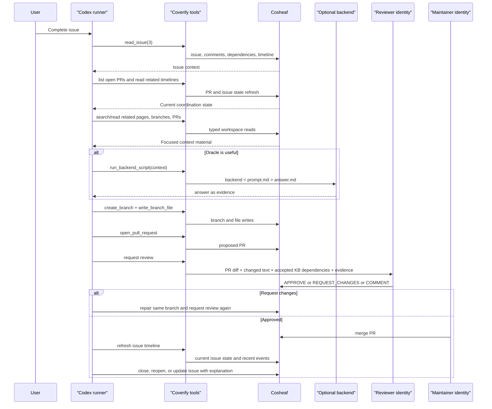

# Coverify Design

Coverify is being restarted as a small Codex tool harness around Cosheaf.
The old proof harness has been removed. Proof work, benchmark work, verifier
calibration, and learning systems are future workflows built on top of this
harness, not the core architecture.

The core invariant:

> If an agent action matters after the process exits, it must leave a Cosheaf
> artifact.

Cosheaf is the durable workspace. Codex or another tool-using runner is the
active operator. Model backends are pluggable helpers that usually accept one
prompt string and return one answer string. Useful output becomes reviewed
knowledge, normally by branch, PR, review, and merge.

## Doc Map

- [README](../README.md) is the repository entry point and status summary.
- [Skills](../skills) are the durable operational interface for orchestrators.
  They cover context building, exploration planning, proof attempts, KB
  writing, PR review, KB management, and the lightweight run loop.
- [Philosophy](philosophy.md) records the stable principles that explain why
  Coverify uses Cosheaf for durable state, topic-shaped knowledge pages,
  reviewed promotion, negative knowledge, and retry gates.
- This file is the canonical architecture and workflow contract.
- The Cosheaf workspace is the tracked mathematical state: topic-first wiki
  pages for durable definitions, results, computations, and failed routes.
  This repository should contain tools, prompts, and reproducibility scripts,
  not the accepted PoA wiki itself.
- [Experiments](experiments.md) defines how to compare the Cosheaf-backed loop
  against one-shot oracles, fixed pipelines, and QED-style strategies.
- Prompt docs are compatibility shims for older docs and PRs, not the
  preferred operational entry point.
- [Prompt Templates](prompts/README.md) indexes those compatibility shims.
- [Coflat Context Primer](coflat-primer.md) is the Markdown format guide used
  when context packs ask a backend to write or review Cosheaf pages.
- [References And Future Notes](references.md) records paper-inspired design
  lessons and future learning notes.

## Roles

- **Cosheaf** stores pages, branches, pull requests, reviews, issues, labels,
  milestones, comments, notifications, and merge state. It is the source of
  truth for humans and agents.
- **Runner** means Codex, another agent, or a future orchestrator. It owns the
  run lifecycle, context selection, tool use, stop conditions, retry policy,
  artifact writing, and final response. It should not be trusted as the source
  of mathematical reasoning when an oracle call is possible.
- **Coverify harness** provides Cosheaf adapters, context-building helpers,
  and backend-script invocation. It must not become a second workflow database.
- **Model backend** means a script, CLI, API wrapper, remote job, or future
  stronger system. The minimum contract is stdin prompt in, stdout answer out.
- **Oracle call** is a backend invocation for a clean reasoning or correctness
  task prepared by a tool-using runner. Mathematical proof attempts,
  obstruction analysis, theorem-choice decisions, and correctness review should
  be delegated to oracle calls whenever possible.
- **Reviewer** is a distinct Cosheaf identity plus an oracle-backed review
  policy. A reviewer identity submits the review result to Cosheaf; the
  correctness judgment should come from the review oracle, not from the runner.

## Package Layers

Coverify's one job is to produce a trustworthy answer: take a question, return
an answer it has checked, with an audit trail. Everything else is either the
substrate for that or a consumer of it. The dividing line with Cosheaf:

- **Cosheaf owns the workspace** — durable state (pages, issues, PRs),
  identity, and presentation/UI. Chat threads, chat tabs, and rendered
  conversations belong here.
- **Coverify owns the thinking** — the verified answer and the audited oracle
  calls. It is the brain, not the workspace; it never grows a UI or a store.
- **Thin glue maps one onto the other** — read Cosheaf state, run an oracle,
  write Cosheaf state back.

The `src/coverify` package makes these layers explicit, with dependencies only
ever pointing inward toward the core:

| Layer | Package | Knows Cosheaf? | Contents |
| --- | --- | --- | --- |
| Core | `coverify.core` | no | backend contract + `BackendRunner`, audit bundles, the verifying oracle |
| Cosheaf client | `coverify.cosheaf` | yes (it *is* the SDK) | the typed Cosheaf HTTP client |
| Integration / glue | `coverify.integration` | yes | `chat-reply`, proof workflows, PR-review decision mapping |
| Applications | `coverify.apps` | mixed | eval harnesses, TTSP search, research tooling |

`coverify.cli` is the top-level orchestrator that wires the layers together. The
rule of thumb: "make the answer better" work lands in core; "talk to the
workspace" work lands in integration; domain experiments land in apps;
presentation never enters Coverify at all.

## State Model

Durable state should map to Cosheaf primitives:

| Need | Cosheaf primitive |
| --- | --- |
| Accepted knowledge | Markdown page merged to `main` |
| Active attempt | Branch |
| Proposed change | Pull request |
| Verification decision | PR review |
| Localized objection | PR line comment |
| Backlog item | Issue, when useful |
| Research program | Milestone |
| Lightweight state flags | Labels on issues or PRs |
| Agent inbox | Notifications |
| Failed attempt memory | Closed PR, closed issue, request-changes review, or merged obstruction |
| Backend/oracle result | Knowledge PR if useful; comment only for transient discussion |
| Run progress | Issue/PR comment, branch commit, review, label, or page update |

Durable state still needs trust distinctions. A merged page is not
automatically an accepted theorem, and an issue comment is not mathematical
evidence by itself. These distinctions should normally be expressed in the
wiki prose, PR body, review, or issue text rather than through a heavy formal
taxonomy. Useful lightweight distinctions include:

| Distinction | Meaning | Default use in context building |
| --- | --- | --- |
| `definition` | active problem statement, conventions, model scope | include when relevant |
| `accepted` | reviewed theorem, example, obstruction, or source-backed bound | include as established context |
| `frontier` | open direction, conjecture, candidate route, or scoped uncertainty | include as hypothesis, not fact |
| `index` | navigation over source notes | include for discovery, not as evidence |
| `process` | provenance, issue history, dogfood lessons, workflow policy | exclude unless the task is workflow design |
| `oracle-output` | raw backend answer or transcript | evidence only; never accepted knowledge by itself |
| `retired` | superseded or out-of-scope material | exclude unless auditing history |

Promotion to `accepted` requires a PR whose changed claims are explicitly
scoped and whose reviewer checks model match, source match, proof details, and
evidence durability. A document containing phrases such as "requires review
before merge", "oracle-generated" as evidence, "candidate lemma" as a theorem,
or unsupported placeholders such as "forgot" is not ready for accepted context.

Local scratch is operational only, but oracle calls need an audit bundle so a
runner can prove what was asked and what came back. Every backend invocation is
one oracle call and gets one local artifact directory keyed by
`oracle_call_id`. It must write `prompt.md`, `answer.md`, `metadata.json`, and
`manifest.json`; wrappers should also preserve stdout/stderr when available.
Metadata must include the provider, model or command, timing, exit status,
timeout state, artifact paths, and content hashes for prompt and answer. A
single runner run may make zero, one, or many oracle calls; each call gets a
different `prompt.md` in its own artifact directory. If the result should
matter tomorrow, the runner must link or distill that audit bundle into
Cosheaf as PR evidence, a review comment, or accepted knowledge. The local
bundle alone is not durable project memory.

Add a local active-job store only after detached or parallel jobs exist. That
store should remain operational: status, heartbeat, cancellation, log pointer,
and linked Cosheaf artifacts. It is not project memory.

Rejected durable stores for v1:

- separate task queue
- coverify-owned issue graph
- proposal/review table
- branch or PR mirror
- hidden long-term agent memory
- learned policy or ranking database

## Cosheaf Contract

Coverify must talk to Cosheaf, not directly to Forgejo. The current Cosheaf
implementation is Forgejo-backed, but Forgejo is an implementation detail.
Coverify-facing tools should expose Cosheaf concepts: pages, branches, PRs,
reviews, issues, labels, comments, notifications, and merge gates.

The current typed API is rooted at:

```text
/api/v1/w/:slug/...
```

Requests authenticate with:

```text
Authorization: Bearer <cosheaf-token>
```

Today that token is a Forgejo PAT resolved by Cosheaf to a workspace user and
role. Keep this as adapter configuration, not workflow state.

Normal workflows must use typed Cosheaf routes. Do not bind coverify to
`/forgejo/...` compatibility routes or Forgejo request bodies. If a needed
operation is missing from Cosheaf, that is Cosheaf API work.

Key route mapping:

| Harness operation | Cosheaf route sketch |
| --- | --- |
| `search_pages` | `GET /search?q=...` |
| `list_workspace_files` | `GET /tree?branch=...` |
| `read_page`, `read_branch_file` | `GET /file?path=...&branch=...` |
| `write_branch_file` | `PUT /file?path=...&branch=...` |
| `delete_branch_file` | `DELETE /file?path=...&branch=...` |
| `create_branch` | `POST /branches` |
| `list_my_branches` | `GET /branches/mine` |
| `open_pull_request` | `POST /pulls` |
| `list_pull_requests` | `GET /pulls?state=...` |
| `read_pull_request` | `GET /pulls/:number` |
| `read_pull_request_context` | `GET /pulls/:number` plus `GET /pulls/:n/files`; runner adds accepted KB dependencies, cited evidence, and relevant review/issue history |
| `review_pull_request` | `POST /pulls/:number/reviews` |
| `comment_on_pull_request_line` | `POST /pulls/:number/comments` |
| `label_pull_request` | `GET /labels`, `PUT /issues/:number/labels` |
| `merge_pull_request` | `POST /pulls/:number/merge` |
| `close_pull_request` | `POST /pulls/:number/close` |
| `list_issues` | `GET /issues?state=...&filter=...&q=...` |
| `read_issue` | issue, comments, dependencies, blocks, timeline |
| `create_issue` | `POST /issues` |
| `edit_issue` | `PATCH /issues/:number` |
| `close_issue`, `reopen_issue` | `PATCH /issues/:number/state` |
| `comment_on_issue` | `POST /issues/:number/comments` |
| `label_issue` | `GET /labels`, `POST /labels`, `PUT /issues/:number/labels` |
| `issue_dependencies` | issue dependencies and blocks routes |
| `list_notifications` | `GET /notifications` |
| `render_markdown` | `POST /markdown/render` |

Important caveats:

- Search is not a substitute for branch or PR context.
- `GET /file` on a branch may fall back to `main`; context packs should
  distinguish branch-local content from inherited content when it matters.
- `GET /tree?branch=...` combines ref files with sidecar metadata. For newly
  changed branch files, trust raw file content and PR diff over sidecar data.
- File writes must use `PUT /file`, which validates paths, handles Markdown,
  updates sidecars, invalidates caches, and emits events.
- PR merge must use typed merge. It enforces fresh admin permission and
  Cosheaf merge cleanup behavior.
- Self-review and author line-comment review are blocked.
- There is no Cosheaf route for backend jobs, oracle execution, or run state.
  Those remain local operational harness state until results are written back.

## Tool Surface

Keep low-level Cosheaf adapter primitives separate from workflow recipes.
V1 should be CLI-first, with command shapes that can be wrapped by MCP later.
This keeps the first implementation easy for Codex to call and easy to test
from a shell.

Adapter primitives:

- `whoami`
- `search_pages`
- `list_workspace_files`
- `read_page`
- `read_branch_file`
- `write_branch_file`
- `delete_branch_file`
- `create_branch`
- `list_my_branches`
- `list_issues`
- `read_issue`
- `create_issue`
- `edit_issue`
- `comment_on_issue`
- `label_issue`
- `list_pull_requests`
- `read_pull_request`
- `open_pull_request`
- `read_pull_request_context`
- `review_pull_request`
- `comment_on_pull_request_line`
- `label_pull_request`
- `merge_pull_request`
- `list_notifications`
- `run_backend_script`
- `build_context_pack` or an equivalent context-building skill

Workflow recipes compose primitives and should start as skills/prompts until they
prove they need code:

- `list_ready_issues`
- `explore_issue`
- `ask_oracle`
- `write_knowledge_pr`
- `review_pr`
- `repair_pr`
- `record_progress`
- `tighten_documents`
- `continue_from_artifact`

## Identities And Review

Every mutating tool call should act as an explicit Cosheaf identity:

- **author identity** creates branches, writes files, opens PRs, comments, and
  records progress
- **reviewer identity** reviews PRs, requests changes, approves, and writes
  line comments
- **maintainer/admin identity** merges when branch protection and policy allow

The same identity should not review its own PR. If no valid reviewer identity
is available, the durable outcome is a comment or label such as `needs-human`,
not self-approval.

Reviewer runs should rebuild context from the PR diff, full submitted changed
text, accepted KB definitions/theorems/source notes used by the change, cited
evidence, and submitted artifacts. A diff is necessary but not sufficient: the
reviewer must also see the accepted statements that the proof invokes or
modifies. Reviewer runs should not rely on the author's private scratch files
or reasoning transcript unless that transcript is itself submitted as evidence.

Reviewer runs are oracle calls. The runner may collect files, citations, issue
context, rendered diffs, and computation outputs, but the approve/request
changes/comment decision should be produced by the correctness-review oracle.
If an oracle cannot be called, the runner should leave a `needs-review` style
comment or label instead of approving knowledge on its own.

The oracle review verdict is binding. The runner must map the oracle's
`DECISION: APPROVE | REQUEST_CHANGES | COMMENT` line directly to the Cosheaf
review event. It may not upgrade `REQUEST_CHANGES` or `COMMENT` to `APPROVE`
because runner-local reasoning thinks the artifact is good enough. If the
verdict is missing, ambiguous, or inconsistent with the body, the safe event is
`REQUEST_CHANGES` or a non-approving comment, never approval. A maintainer merge
is allowed only after a valid reviewer identity has recorded approval for the
current PR state.

The review gate is about correctness, not document type. A literature note can
be wrong by citing a theorem outside its hypotheses; an example note can be
wrong by miscomputing a cost or missing a profitable deviation; a status note
can be wrong by promoting a conjectural obstruction to accepted knowledge. The
same skeptical review policy applies to all knowledge-changing PRs, with
reference and computation checks included when relevant.

The review gate must also check promotion hygiene:

- source-backed bounds restate model scope: player type, weights, objective,
  graph class, symmetry/asymmetry, latency class, and quantitative bound;
- frontier notes do not contain theorem-shaped claims without proof;
- state maps are indexes over source notes, not independent sources of truth;
- process/provenance notes are marked as process context and excluded from
  mathematical golden context by default;
- raw oracle output, offline runs, terminal output, and local audit bundles are
  not cited as durable evidence unless linked or distilled into reviewed
  Cosheaf artifacts;
- stale pre-review text is removed before merge.

Review decisions:

- `APPROVE`: safe to merge into accepted knowledge.
- `REQUEST_CHANGES`: wrong, underspecified, unsupported, unclear, inconsistent,
  or not decidable from the PR.
- `COMMENT`: non-blocking notes only.

If a reviewer cannot decide correctness, it should request changes and state
what would make the PR decidable.

Runner-local checks are allowed only as preflight and packaging: make sure the
context pack is complete, references are attached, computations are reproducible
or summarized, and the oracle output can be mapped to Cosheaf review events.
They are not a substitute for an oracle correctness decision.

## Context Packs

Context building is an orchestrator responsibility. A context pack is a
temporary working excerpt for one task, not a durable artifact class and not a
second knowledge base. The orchestrator may build it directly or use
[`coverify-context-builder`](../skills/coverify-context-builder/SKILL.md).

`build_context_pack`, if implemented as code, should take artifact references
and a task:

```text
workspace
artifact refs: issues, PRs, branches, paths, block ids
question or task
output purpose: Codex work, oracle call, PR review, doc tightening
```

It returns concise Markdown/plain text with whichever parts are relevant:

```text
Objective
Current artifacts
Accepted knowledge entries with status
Open hypotheses
Relevant pages
Relevant issues
Relevant PRs and reviews
Failed attempts
Current branch or PR diff
Constraints
Question for this run
Expected output shape
```

The pack must preserve artifact ids and trust distinctions in normal language:
accepted pages, proposed diffs, request-changes reviews, rejected attempts,
uncertain claims, and raw oracle output are not interchangeable. It does not
need to force every item into a fixed status vocabulary. When the pack asks a
backend to produce or review page text, include the relevant parts of the
[Coflat Context Primer](coflat-primer.md).

In particular, process notes, issue histories, and provenance are not accepted
mathematical context; include them only when they matter to the task. Index
pages may help find source notes, but the source note must be included for any
claim used as evidence.

The pack is not private memory. If a context summary is useful after a run,
turn it into a normal wiki edit or issue/PR comment. Otherwise discard it.

## Backends And Oracles

The minimum backend contract:

```text
stdin:  prompt string
stdout: answer string
exit 0: completed
exit nonzero: failed, with stderr/logs preserved
```

This supports a shell script, Python script, API client, Codex wrapper, Claude
wrapper, Antigravity wrapper, remote poller, or future model service. Richer
adapters may add streaming, metadata, and cancellation later.

The default v1 oracle backend should be a thin wrapper around non-interactive
Codex:

```bash
codex exec \
  --json \
  --skip-git-repo-check \
  --ephemeral \
  --ignore-user-config \
  -C "$WORKDIR" \
  -s read-only \
  -m gpt-5.5 \
  -c 'model_reasoning_effort="xhigh"' \
  -o answer.md \
  -
```

The wrapper sends the prompt on stdin and returns the final message from
`answer.md`. It must also preserve a complete local audit bundle:

```text
prompt.md       exact oracle input
answer.md       final oracle output
stdout.jsonl    provider event stream, when available
stderr.log      provider diagnostics, when available
metadata.json   oracle_call_id, provider, model/command, timing, status, hashes
manifest.json   paths, byte sizes, and hashes for all recorded artifacts
workdir/        isolated provider working directory, when applicable
```

The prompt should contain all task context. For ordinary oracle calls, run in a
scratch or controlled read-only working directory and do not rely on Codex
session memory, project files outside the context pack, or hidden user config.
When an oracle result is used to approve, request changes, write knowledge, or
justify a claim, the Cosheaf PR/comment should include the `oracle_call_id`,
provider/model, prompt hash, answer hash, and a short statement of what context
was included. This is still the same backend contract:

```text
prompt string -> backend wrapper -> answer string
```

Oracle use is the default for mathematical reasoning. The runner should call an
oracle whenever it is asking a question whose answer depends on proof search,
nontrivial mathematical judgment, theorem applicability, obstruction analysis,
or correctness verification. The runner may decide that an oracle call is not
needed only for mechanical actions such as reading Cosheaf state, packaging a
context pack, running an enumerator, transcribing a cited theorem, opening a
PR, or recording an oracle's answer.

When budget or availability prevents an oracle call, the artifact must say so.
Do not silently turn runner reasoning into accepted knowledge.

Other providers can implement the same contract:

- **Claude**: useful as an alternate oracle/reviewer backend through
  `claude --print` or equivalent non-interactive mode.
- **Antigravity CLI**: plausible future backend through `agy --print`, but it
  should stay experimental until it can be tested in this workflow.
- **Custom script**: any executable satisfying `backend < prompt.md >
  answer.md`.

Backend calls may run for a long time. In v1, preserve a simple operational
trail:

- start time, backend name, and linked Cosheaf artifact
- stdout/stderr or log path while the job runs
- timeout/cancellation wrapper when practical
- failure or timeout comment when it affects the work
- raw successful output while Codex evaluates it, with prompt/output hashes
- reviewed knowledge PR, review evidence, or transient comment if useful

An oracle is not an agent. Good oracle tasks:

- prove a statement from curated context
- review a proof or PR diff
- find an obstruction or counterexample
- suggest next mathematical routes from a curated summary

Bad oracle tasks:

- browse the workspace
- choose what issue to work on
- reconstruct project history
- manage branches, PRs, or reviews

Raw oracle output is evidence, not truth. Quarantine it while evaluating. If
preserved in Cosheaf, label it as `oracle-output`; if it is useful, distill it
into reviewed claims, obstructions, or questions.

### Self-Verifying Oracle

Because every backend is `prompt -> BackendResult`, a backend may itself be
composed of other backends. The `verifying` backend (`coverify.core.verifying`)
is such a composite: it produces its answer by running a generate → verify →
adjudicate loop over sub-oracles.

- a generator produces a candidate answer;
- one or more verifiers act as adversarial referees, each ending its reply with
  a single `VERDICT: PASS | FAIL` line; failing critiques feed back to the
  self-revising generator;
- any FAIL triggers another round; the loop stops on the first all-PASS round,
  or when `max_rounds` is exhausted;
- a final adjunct always writes the natural-language reply, asserting only what
  was verified and stating plainly what it could not.

A broken verifier (call failure after retries, or no parseable verdict) is
ERROR. The lenient default treats ERROR as PASS for loop control so a run still
produces something, recording the unrun check in the audit journal; a `strict`
profile refuses to answer instead. Each step (generator, verifier, adjunct) is a
`{backend, prompt}`, so profiles can mix backends and add custom verifiers;
named profiles and a JSON config select them. The verify/revise rounds are the
oracle's private reasoning and stay in the audit bundle, not in PR or issue
threads — only the adjudicated answer is surfaced. Runs are journaled, so an
interrupted oracle resumes from completed steps rather than restarting.

This is the same backend contract, so a verifying oracle drops into
`ask-oracle`, `run-eval`, and the workflows unchanged, and can even nest inside
another verifying oracle as one of its verifiers.

### Issue Chat

`chat-reply` (integration glue) treats a Cosheaf issue as a chat thread: the
opening post and each comment is one turn. It reads the thread, runs the
configured oracle — normally a verifying oracle — on the conversation, and posts
one adjudicated reply as a comment. The chat data lives in Cosheaf issues, so
the feature degrades gracefully when Coverify is offline: the thread still
renders, the reply just has not arrived yet. Any chat UI belongs in Cosheaf
(a view over issues), not in Coverify.

## Knowledge Workflow

The normal durable path:

```text
task or question
  -> exploration/reasoning
  -> branch edits knowledge files
  -> PR proposes the knowledge update
  -> reviewer checks correctness
  -> merge accepts knowledge
```

Merged pages are trusted context, but not a flat pile of theorems. Reusable
mathematical content should be identifiable and status-aware. A theorem-like
or obstruction-like entry should include, when applicable:

- stable block id
- status
- statement or question
- hypotheses and ambient conventions
- dependencies by id or page path
- proof, proof sketch, obstruction, or counterexample
- examples or counterexamples checked
- source PR/review or provenance note
- caveats and remaining open points

Before a runner opens a knowledge PR, it should run a promotion audit over the
changed text:

```text
1. What exact claim is being promoted?
2. Is the claim a definition, theorem, example, obstruction, frontier note,
   process note, index entry, raw oracle output, or retired evidence?
3. What model scope does it use: weighted/unweighted, atomic/non-atomic,
   symmetric/asymmetric, graph class, objective, latency class?
4. What evidence supports it: proof, source theorem, checked example,
   durable computation, or reviewed obstruction?
5. Does any sentence preserve scratch provenance, pre-review language, or a
   broader claim than the evidence proves?
6. Should this go into an issue/comment/frontier note instead of accepted
   context?
```

The reviewer should repeat this audit independently. A request-changes result is
progress when it prevents contaminated context from entering `main`.

Dead ends are knowledge when precise:

```text
Target claim:
Route tried:
Failing step:
Missing assumption or obstruction:
Evidence:
Artifacts consulted:
Do not retry unless:
```

Do not bury durable dead ends only in chronological comments.

For small repositories, a single topic file such as `knowledge.md` or
`results.md` may be enough, with sections for accepted results, obstructions,
open questions, conventions, and references. Split by topic or size only when
one file becomes hard to review or navigate.

A reviewer of a large file checks the changed diff, local surrounding section,
relied-on accepted results, meaning changes to earlier text, and internal
consistency. It should not re-prove the whole file on every PR.

For messy useful output, use two steps:

```text
PR 1: record the precise new knowledge
PR 2: tighten and integrate exposition
```

The first PR still needs to be polished accepted knowledge, not raw oracle
transcript.

## Typical Issue Run

An issue-driven run is one concrete case. Direct requests such as "tighten
these docs" can skip issue reads and go straight to context gathering, branch
edits, and PR review.



Completion means a durable Cosheaf outcome exists:

- merged PR changed accepted pages
- issue closed with a clear reason
- issue decomposed into clearer questions
- issue or PR labeled `blocked` or `needs-human` with explanation
- PR has concrete request-changes feedback and a next step
- useful backend/Codex/oracle output became proposed or accepted knowledge

No changed Cosheaf artifact means no durable progress.

### State-Transition Discipline

Issue and PR state changes are coordination-sensitive. A runner must refresh
the relevant Cosheaf state immediately before changing it:

- before starting issue work: read the issue, its timeline, and open PRs;
- before opening a PR: check whether another open PR already addresses the
  same issue or file surface;
- before merging: require an oracle-backed reviewer approval artifact and
  refresh PR metadata;
- before closing or reopening an issue: read the issue timeline and the PR
  that most recently closed or referenced it;
- after merge: read the open issue list again because Forgejo-style issue
  references may have changed issue state automatically.

State changes should leave an explanation as a Cosheaf comment when the reason
is not already obvious from the merged PR. Reopening an issue is not just the
inverse of closing it: the runner must explain which part of the issue remains
unresolved after reading the timeline.

Branch file writes should be serialized per branch. Multiple concurrent writes
to the same branch head can race in the underlying repository. If the workflow
needs multi-file changes, write files one at a time or use a future
compare-and-set branch-head API.

Search and computation artifacts should state their trust posture in ordinary
language:

- **lead**: scratch search, floating LP output, or unreviewed oracle idea;
- **locally verified**: exact arithmetic or deterministic code checked by the
  runner;
- **oracle reviewed**: correctness review returned an approval verdict;
- **accepted**: merged into Cosheaf knowledge after review.

Only accepted artifacts are knowledge. Leads may guide the next run, but they
must not be cited as mathematical evidence until promoted through exact
verification, PR review, and merge.

The philosophy behind these trust distinctions is in
[Coverify Philosophy](philosophy.md). In particular, negative knowledge is
durable when it changes future behavior: a failed route should be promoted only
after it has been distilled into a compact, reviewable topic-page note with a
clear retry condition.

## Runs, Jobs, Progress, And Claiming

A **run** is one bounded execution attempt by a runner. The runner owns it.
Coverify does not create a durable run object. A run can contain multiple
oracle calls, for example one exploration call, one proof-attempt call, and one
review call. Those calls are represented by separate local artifact
directories and by whatever Cosheaf PR/comment/knowledge artifacts the runner
creates from them.

A **job** is a child execution launched during a run, usually a backend script,
CLI subprocess, API wrapper, or remote model invocation. Foreground logs are
enough for v1. A job table is only needed for detached or parallel jobs.

Progress means one of these happened:

- PR merged and changed accepted pages
- PR received request-changes with concrete objections
- dead end, failed route, or obstruction was merged as accepted knowledge
- backend/Codex/oracle output became a reviewed knowledge PR
- issue was decomposed when useful
- issue or PR was closed/labeled with evidence
- `needs-human` was added because the system found a real boundary

For v1, assume one active runner. There is no `agent_id`, claim lease table,
or in-progress label. If multiple workers are added later, use a tiny
operational lease with fields such as `run_id`, `runner_name`, `issue_number`,
`heartbeat_at`, and `expires_at`; it should only prevent duplicate live work.

## Prompt Taxonomy

The core prompt surface should stay small. V1 has three canonical prompt
families:

1. **Explore**: inspect current accepted knowledge, failed attempts, open
   issues, and PRs; propose issue-ready next directions.
2. **Attempt**: given one well-defined direction or statement, try to prove or
   disprove it, or produce a precise obstruction.
3. **Review**: given proposed mathematical knowledge, decide whether it passes
   the PR correctness gate.

The attempt and review prompts are oracle prompts. The runner prepares their
inputs and records their outputs; it should not replace them with its own
mathematical judgment when an oracle is available. Explore can be runner-driven
when it is only indexing state, but any exploration step that requires
mathematical prioritization or correctness judgment should also become an
oracle call.

Tactics such as constructing counterexamples, toy examples, decompositions,
literature checks, recursive proving, failure analysis, PR writing, and
document tightening are usually choices made by the runner while preparing
context or by an oracle inside one of these prompts. Do not turn every tactic
into a durable workflow state. A skill is appropriate when the orchestrator
should reliably reuse the procedure across runs.

One exception is artifact writing. The math oracle should not be burdened with
Coflat formatting instructions. A knowledge-base writer can distill useful
oracle output, calculations, and issue conclusions into Coflat Markdown with
math mode, semantic definition/theorem/proof blocks, stable ids, trust labels,
internal links to accepted pages or block ids, and a reviewer checklist. This
writer is not a fourth mathematical reasoning role: it does not add claims and
does not approve correctness. Open issues and PRs may be linked as workflow
pointers, but not cited as mathematical evidence.

Every durable math-document write should pass through this writer step. Direct
oracle-output-to-file is allowed only for raw artifacts, comments, or audit
records; accepted pages should be math documents, not transcripts or code-style
blocks.

The concrete v1 operational skills are:

- [`coverify-run-loop`](../skills/coverify-run-loop/SKILL.md)
- [`coverify-context-builder`](../skills/coverify-context-builder/SKILL.md)
- [`coverify-exploration-planner`](../skills/coverify-exploration-planner/SKILL.md)
- [`coverify-proof-attempt`](../skills/coverify-proof-attempt/SKILL.md)
- [`coverify-kb-writer`](../skills/coverify-kb-writer/SKILL.md)
- [`coverify-proof-review`](../skills/coverify-proof-review/SKILL.md)
- [`coverify-kb-manager`](../skills/coverify-kb-manager/SKILL.md)

The prompt files under [prompts](prompts/README.md) preserve longer source
text and reference patterns. The skills are the orchestration interface.

The writer exists because useful oracle output still needs to become a durable
Cosheaf document. The manager exists because accepted workspaces need periodic
consolidation. The manager may create large PRs and complete rewrites when the
user explicitly asks for a cleanup pass, but it is not a fourth mathematical
reasoning role. It should organize, combine, delete, retire, index, and clarify
accepted documents using the topic structure that best fits the material; any
correctness-relevant change still uses the review
prompt before merge. Narrow mathematical fixes should stay narrow instead of
becoming opportunistic repo rewrites. Large cleanup passes should prefer a
smaller, indexed knowledge base over preserving old file boundaries.

Each template should define required inputs, required outputs, refusal
behavior, trust handling, and allowed artifact effects. Larger QED/Rethlas
prompt families are reference patterns, not a target architecture.

Oracle prompts should prefer actionable uncertainty fields:

```text
JUDGMENT:
USEFUL_OBSERVATIONS:
MISSING_STEPS:
CHECKS_TO_RUN:
POSSIBLE_COUNTEREXAMPLES:
LIKELY_DEAD_ENDS:
NEXT_STEPS:
```

Reviewer output should use a predictable shape:

```text
DECISION: APPROVE | REQUEST_CHANGES | COMMENT
PROBLEM_INTEGRITY:
CITATION_GROUNDING:
KEY_STEP_REVIEW:
LOCAL_CORRECTNESS:
STYLE_OR_ORGANIZATION:
BLOCKING_CHANGES:
NON_BLOCKING_NOTES:
```

## Build Order

1. Implement minimal branch/PR/issue-native Cosheaf tools.
2. Add a smoke harness that validates current Cosheaf API operations and
   leaves inspectable issues, branches, PRs, reviews, and pages.
3. Add and keep complete the Coverify skills under `skills/`.
4. Add pluggable backend invocation with the stdin/stdout script contract,
   starting with the Codex `gpt-5.5` + `xhigh` wrapper.
5. Add promotion-audit checks for trust distinctions, model scope, stale
   pre-review language, and durable evidence before any PR can be treated as
   accepted knowledge.
6. Add `ask_oracle` as a backend-backed workflow whose useful outputs become
   knowledge PRs.
7. Add thin command/skill wrappers only for repeatable glue around the three
   canonical prompts: explore, attempt, and review.
8. Add a lease table only when more than one runner can work in parallel.
9. Only then reintroduce proof-specific benchmarks, verifier calibration, or
   learning/evaluation work.
10. Use [Experiments](experiments.md) to compare proof strategies once the
   issue/PR/review loop is stable.

## Non-Goals

- No separate durable task database.
- No coverify-owned review queue.
- No hidden agent memory that humans cannot inspect.
- No provider-specific oracle design in the core.
- No direct Forgejo access from the harness.
- No proof-specific architecture in the core tool layer.
- No scheduler, learned prioritizer, or multi-agent allocation layer in v1.

## Open Questions

- Which reviewer identities are needed first: math, style, oracle-backed, or
  human-only?
- Should the default knowledge file be `knowledge.md`, `results.md`, or
  topic-specific?
- When should a topic split from one knowledge file into multiple files?
- What exact PR body template makes mathematical review fastest?
